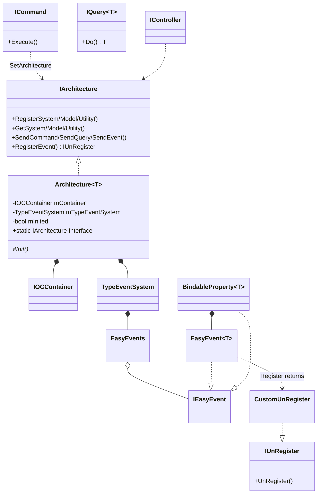
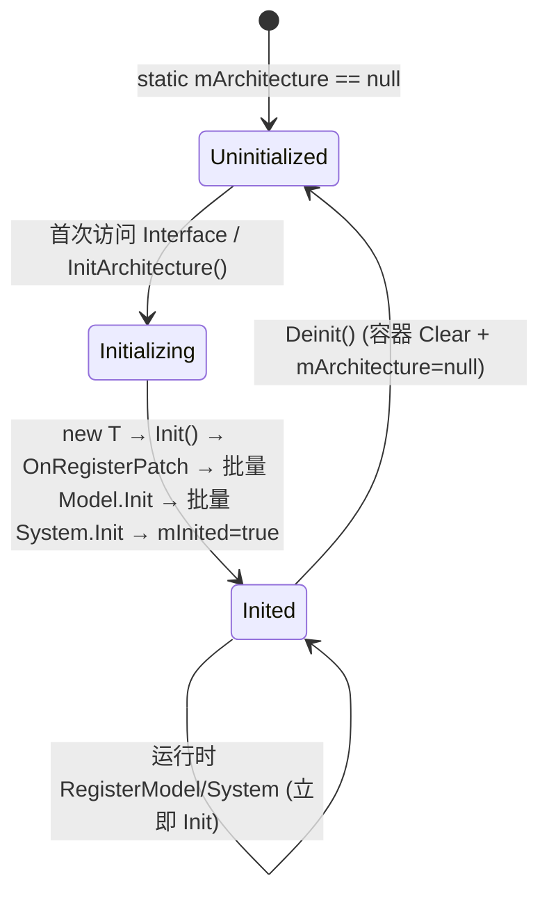
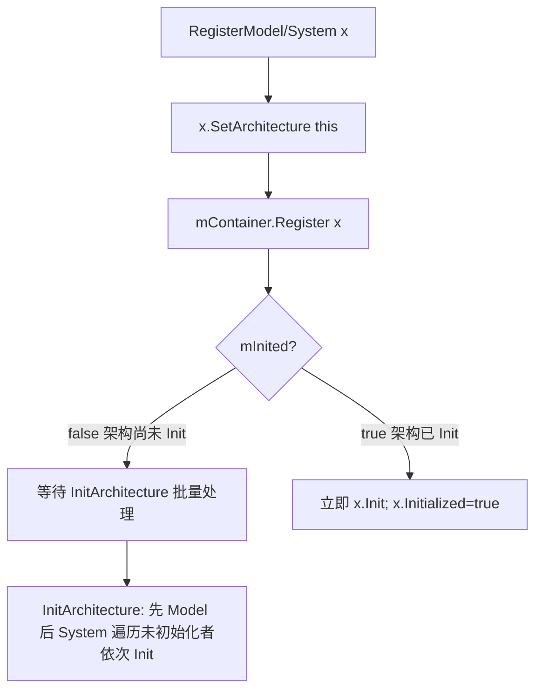
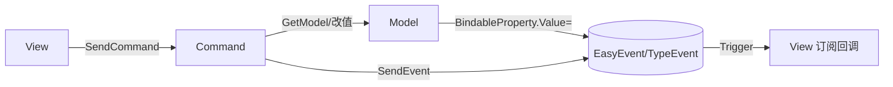

# 01 · CoreArchitecture 解析

> 源码：`Assets/QFramework/Framework/Scripts/QFramework.cs`（单文件 960 行，全部已读）。
> 这是整个 QFramework 的母体，下面所有 Kit 的事件/响应式/注入机制都根植于此。

---

## 一、契约定义

### 核心类型清单

| 文件区块 | 类型 | 角色 | 可见性 |
|---|---|---|---|
| `#region Architecture` | `IArchitecture` | 架构门面接口：注册/获取 System·Model·Utility，发送 Command·Query·Event | public |
| | `Architecture<T>` | CRTP 抽象基类，单例式持有一套容器 + 事件系统 | public abstract |
| `#region IOC` | `IOCContainer` | 按 `Type→object` 存储的极简容器 | public |
| `#region System/Model/Utility` | `ISystem`/`IModel`/`IUtility` + `Abstract*` | 三层职责载体（逻辑/数据/无状态工具） | public |
| `#region Command/Query` | `ICommand`/`ICommand<T>`/`IQuery<T>` + `Abstract*` | 写操作 / 读操作的命令对象 | public |
| `#region Rule` | `IBelongToArchitecture`/`ICanGetModel`/`ICanSendEvent`... | **能力接口**（标记接口）+ 配套静态扩展 | public |
| `#region TypeEventSystem` | `TypeEventSystem` | 以"事件类型"为 key 的事件总线 | public |
| | `IUnRegister`/`CustomUnRegister`/`UnRegisterTrigger` | 注销句柄 + Mono 生命周期绑定 | public |
| `#region BindableProperty` | `IBindableProperty<T>`/`BindableProperty<T>` | 值变更可监听属性 | public |
| `#region EasyEvent` | `IEasyEvent`/`EasyEvent`/`EasyEvent<T..>`/`EasyEvents` | 委托封装的最小事件单元 + 类型化事件仓库 | public |
| `#region Event Extension` | `OrEvent` | 多事件"或"组合 | public |

### 穿透语法的关键设计约束

1. **CRTP 单例架构**：`Architecture<T> where T : Architecture<T>, new()`。`mArchitecture` 是 `static T`，`Interface` getter 惰性触发 `InitArchitecture()`。**每个派生架构类型有自己独立的一份 static 实例与容器**——这是"一个游戏一个 Architecture"的根。

2. **注册时机决定初始化时机**：`RegisterSystem/Model` 内部判断 `mInited`。架构 `Init()` 之前注册的，由 `InitArchitecture()` 统一按 Model→System 顺序批量 `Init()`；架构 `Init()` 之后注册的，立即 `Init()`。这是"延迟批量初始化 + 运行时即时初始化"的双模式（落地难点之一）。

3. **能力即接口，行为在扩展方法**：`IController` 不含任何方法，只继承一堆 `ICanGetModel/ICanSendCommand/...` 标记接口；真正的 `GetModel<T>()` 等实现在 `CanGetModelExtension` 静态类里，通过 `self.GetArchitecture().GetModel<T>()` 转发。**接口只声明"你能做什么"，扩展方法提供"怎么做"**——这是全框架最核心的注入/能力裁剪母题。

4. **Command/Query 无状态、用后即弃**：`SendCommand` 内部 `command.SetArchitecture(this); command.Execute()`。命令对象自身不被容器持有，执行完即丢（GC 回收）。它们持有的是"对架构的引用"，从而能在 `OnExecute` 里反向 `this.GetModel<T>()`。

5. **事件系统三件版本并存**：`EasyEvent`（无参委托）、`EasyEvent<T>`（按类型 key 存于 `EasyEvents` 字典）、`TypeEventSystem`（对 `EasyEvents` 的门面）。`BindableProperty` 与 `TypeEventSystem` 都建立在 `EasyEvent` 之上。

### Mermaid 类图（核心骨架）

---

## 二、生命周期与内存

### 动词语义表

| 操作 | 做什么 | 内存影响 |
|---|---|---|
| `Architecture<T>.Interface` (首访) | 惰性 `new T()` + `Init()` + 批量初始化 Model/System | 分配：1 个架构实例 + 1 个 `IOCContainer` + 1 个 `TypeEventSystem` |
| `RegisterModel/System(x)` | `x.SetArchitecture(this)` + 存入容器；按 `mInited` 决定是否立即 `Init()` | 容器字典新增一项（按 `typeof(T)` 去重，重复 key 覆盖） |
| `RegisterUtility(x)` | 仅存入容器，**不调用 Init**（Utility 无生命周期） | 同上 |
| `GetModel/System/Utility<T>()` | 容器 `Get<T>()`，`TryGetValue` 后 `as T` | 无分配，返回已存实例或 null |
| `SendCommand(cmd)` | 注入架构引用并 `Execute()`，命令对象不被持有 | cmd 由调用方 new，执行后可被 GC |
| `SendEvent<T>(e)` | `mTypeEventSystem.Send<T>(e)`，找不到事件则静默 | 无分配（无参版本 `new T()` 会分配一个事件对象） |
| `RegisterEvent<T>(cb)` | `GetOrAddEvent<EasyEvent<T>>().Register(cb)` | 首注册某类型时分配一个 `EasyEvent<T>`；返回 `CustomUnRegister`（struct，无堆分配） |
| `UnRegisterEvent<T>(cb)` | `mEvents.GetEvent<EasyEvent<T>>()?.UnRegister(cb)` | 委托 `-=`，不移除空事件对象（残留空 `EasyEvent<T>`） |
| `Deinit()` | `OnDeinit` → System/Model 各 `Deinit()` → 容器 `Clear()` → `mArchitecture=null` | 释放容器引用；下次访问 `Interface` 重新初始化 |

### 状态机：Architecture 初始化状态

### 关键流程：注册→初始化的双路径

> 穿透点：`InitArchitecture` 用 `Where(m => !m.Initialized)` 过滤——保证幂等，且 **Model 永远先于 System 初始化**（数据先就绪，逻辑后启动）。`OnRegisterPatch` 在两批初始化之前调用，是单元测试/Mock 注入的官方注入点。

### EasyEvent 的内存语义（注销句柄）

`EasyEvent.Register` 返回 `new CustomUnRegister(() => UnRegister(onEvent))`。`CustomUnRegister` 是 **struct**，包装一个 `Action`。调用 `UnRegister()` 后把内部委托置 null（防重复注销）。`UnRegisterTrigger`（MonoBehaviour）用 `HashSet<IUnRegister>` 收集句柄，在 `OnDestroy`/`OnDisable`/场景卸载时批量 `UnRegister()`——把"事件注销"挂到 Unity 对象生命周期上，杜绝悬挂回调导致的内存泄漏与空引用。

---

## 三、跨层桥接

### 核心层与上层如何对接

- **上层（System/Model/Command/Controller）→ 核心**：全部通过"能力接口 + 扩展方法"。例如 Command 的 `OnExecute` 里写 `this.GetModel<XxxModel>()`，编译期靠 `ICanGetModel` 约束放行，运行期靠 `GetArchitecture()` 拿到架构再转发。**架构引用是上层对象与核心层之间唯一的桥**，由 `SetArchitecture` 在注册/发送时注入。

- **MonoBehaviour（View/Controller）→ 核心**：通常 View 实现 `IController`，并重写 `GetArchitecture()` 返回 `XxxArchitecture.Interface`。注册事件后用 `.UnRegisterWhenGameObjectDestroyed(gameObject)` 把注销绑定到 GameObject 生命周期。

### 注入点在哪

| 注入点 | 机制 | 用途 |
|---|---|---|
| `Architecture.OnRegisterPatch` | `static Action<T>` | 初始化前替换/追加注册（测试 Mock） |
| `ICanSetArchitecture.SetArchitecture` | 注册/发送时调用 | 把架构引用注入上层对象 |
| `BindableProperty<T>.Comparer` | `static Func<T,T,bool>` | 自定义"值是否变化"判定（`ComparerAutoRegister` 为常见值类型预置 `==`） |
| `IOnEvent<T>` + `OnGlobalEventExtension` | 接口 + 扩展 | 让任意对象 `this.RegisterEvent<T>()` 接入全局 `TypeEventSystem.Global` |

### 跨层 DTO / 快照传递

- **事件即 DTO**：`SendEvent<TEvent>(e)` 中 `TEvent` 通常是一个值对象（struct/class），承载一次状态变化的快照，从 Command/System 流向订阅者。事件不可变是隐含约定。
- **BindableProperty 即可观测快照**：`Value` 的 set 经 `Comparer` 去重后 `Trigger(value)`，把新值快照推给所有监听者。`RegisterWithInitValue` 在注册瞬间先回调一次当前值——保证 UI 初始状态与数据一致。

数据流向（典型 MVC-like 闭环）：

---

## 四、落地难点（脱离框架仿写时最有价值的 3 点）

1. **CRTP + static 容器的"每类型一实例"语义**：`Architecture<T>` 的 `static T mArchitecture` 意味着 `class GameArch : Architecture<GameArch>` 与 `class OtherArch : Architecture<OtherArch>` 各有独立单例与容器。仿写时若误用非泛型 static 字段，会让所有架构共享一份容器。难点在于理解 `static` 字段在泛型类里"按封闭类型各一份"的 CLR 语义。

2. **注册/初始化的双路径幂等**：必须同时支持"Init 前批量注册→统一初始化"和"Init 后动态注册→即时初始化"，且用 `Initialized` 标志保证不重复 Init。漏掉 `mInited` 判断会导致运行时注册的 System 永远不 `Init`，或启动期注册的被 Init 两次。

3. **能力接口拆分 + 扩展方法转发**：Command 能 Get/Send 一切，Query 只能 Get + SendQuery（不能改数据），Model 只能 GetUtility + SendEvent（不能 GetModel/GetSystem，防止 Model 互相耦合）。这套"按角色裁剪能力"完全靠接口继承组合 + 扩展方法实现，**没有一行运行时检查**。仿写时最易错的是把所有能力塞进一个基类，丢失编译期的职责约束。

---

## 五、坐标

- **优先级**：最高（P0），是所有 Kit 的根。
- **依赖谁**：无（自包含，仅依赖 UnityEngine 基础类型）。
- **被谁依赖**：EventKit、BindableKit、ActionKit 直接复用其 `EasyEvent`；几乎所有业务层依赖 `Architecture`/`Command`/`Event`。
