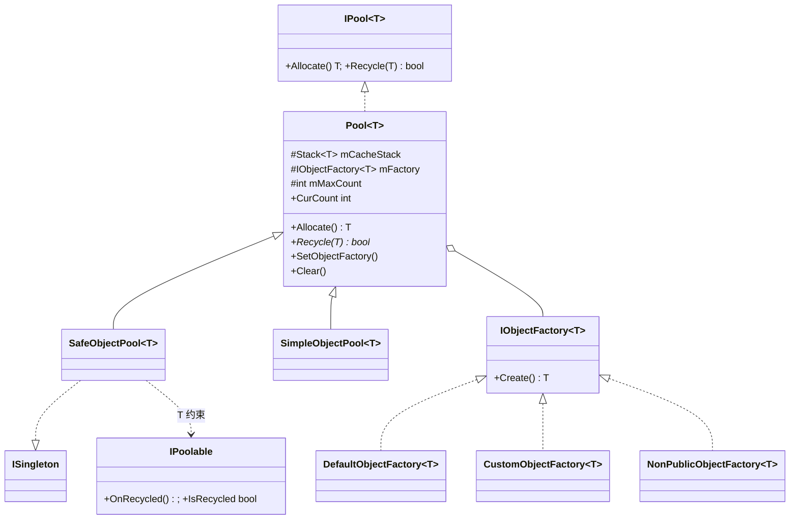
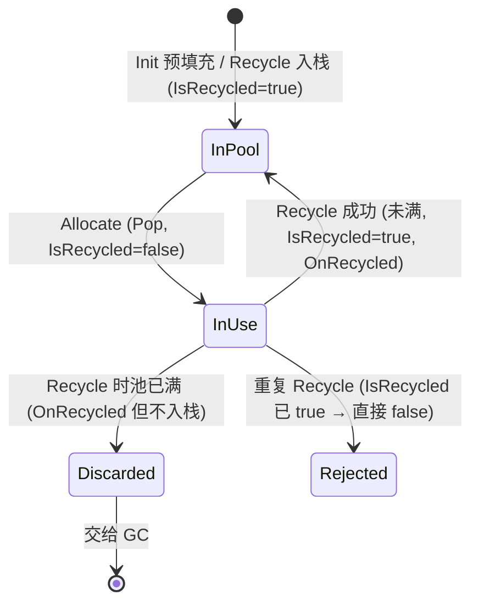
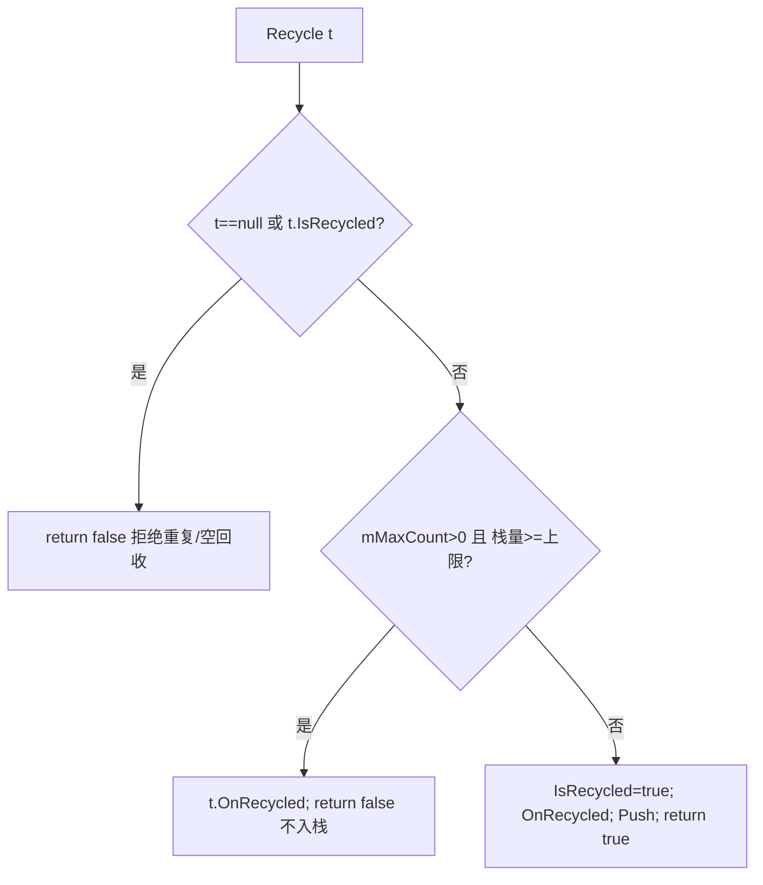

# 02 · PoolKit 解析

> 源码（全部已读）：`_CoreKit/PoolKit/Scripts/` 下
> `Pool/IPool.cs`、`Pool/Pool.cs`、`Pool/IPoolable.cs`、`Pool/IPoolType.cs`、
> `SafeObjectPool.cs`、`SimpleObjectPool.cs`、`ListPool.cs`、`DictionaryPool.cs`、
> `Factory/{IObjectFactory,CustomObjectFactory,DefaultObjectFactory,NonPublicObjectFactory}.cs`。

---

## 一、契约定义

### 核心类型清单

| 文件 | 类型 | 角色 | 可见性 |
|---|---|---|---|
| `IPool.cs` | `IPool<T>` | 池接口：`Allocate()` / `Recycle(obj)` | public |
| `Pool.cs` | `Pool<T>` | 抽象基类：持 `Stack<T> mCacheStack` + `IObjectFactory<T>`，实现 `Allocate`，`Recycle` 抽象 | public abstract |
| `SafeObjectPool.cs` | `SafeObjectPool<T>` | 单例池，约束 `T:IPoolable,new()`，带 `IsRecycled` 防重复回收 + 容量上限 | public |
| `SimpleObjectPool.cs` | `SimpleObjectPool<T>` | 非单例、面向业务，构造时传工厂方法 + 可选重置委托 | public |
| `ListPool.cs` | `ListPool<T>` (static) | 复用 `List<T>`，`Get`/`Release`，Release 时 `Clear` 并查重 | public static |
| `DictionaryPool.cs` | `DictionaryPool<TKey,TValue>` | 复用 `Dictionary`，同上但不查重 | public |
| `IPoolable.cs` | `IPoolable` | `OnRecycled()` + `bool IsRecycled` | public |
| `IPoolType.cs` | `IPoolType` | `Recycle2Cache()`（对象自回收语义） | public |
| `Factory/*` | `IObjectFactory<T>` + 3 实现 | 对象创建策略注入点 | public |

### 穿透语法的关键设计约束

1. **栈式缓存（LIFO）**：所有池底层都是 `Stack<T>`。`Allocate` = `Pop`（空则工厂 `Create`），`Recycle` = `Push`。选 Stack 而非 Queue：刚回收的对象 CPU cache 更热，且实现最简。

2. **创建策略与池解耦（工厂注入）**：`Pool<T>` 不直接 `new T()`，而是持 `IObjectFactory<T> mFactory`。四种工厂——`Default`(new)、`Custom`(Func)、`NonPublic`(反射私有构造)、可 `SetObjectFactory/SetFactoryMethod` 运行时替换。这让"如何造对象"完全可插拔。

3. **SafeObjectPool 的双重防护不变量**：`Recycle` 里 ①`t==null || t.IsRecycled` 直接 false（防重复回收）；②超 `mMaxCount` 时调 `OnRecycled()` 但**不入栈**返回 false（防无限增长）；正常路径置 `IsRecycled=true` + `OnRecycled()` + `Push`。`Allocate` 取出后必置 `IsRecycled=false`。**`IsRecycled` 是对象"在池中/在外面"的唯一真相**。

4. **SimpleObjectPool 故意"不安全"**：`Recycle` 无任何校验，直接 `mResetMethod?.Invoke(obj); Push`。它信任调用方不重复回收——换取零开销与对任意类型（无需 `IPoolable`）的支持。ActionKit 全部用它。

5. **静态集合池的查重差异**：`ListPool.Release` 会 `mListStack.Contains(toRelease)` 抛异常防重复回收；`DictionaryPool.Release` **没有**这层检查。这是一处真实的不对称（落地难点）。

### Mermaid 类图

---

## 二、生命周期与内存

### 动词语义表

| 操作 | 做什么 | 是否分配/释放 |
|---|---|---|
| `Pool.Allocate()` | 栈空→`mFactory.Create()`（**分配**）；非空→`Pop()`（**复用**） | 仅栈空时 new |
| `SafeObjectPool.Allocate()` | 调 base.Allocate + `result.IsRecycled=false` | 同上 |
| `SafeObjectPool.Recycle(t)` | 校验→`IsRecycled=true`+`OnRecycled()`+`Push` | 不分配；满栈时丢弃（让 GC 回收该对象） |
| `SimpleObjectPool.Recycle(obj)` | `mResetMethod?(obj)` + `Push` | 不分配，无校验 |
| `Init(max,init)` | 预填充：循环 `Recycle(mFactory.Create())` 直到 init 个 | 分配 init 个对象入池 |
| `MaxCacheCount = n` (set) | 若新上限 < 当前栈量，循环 `Pop` 丢弃超额对象 | 释放（丢弃引用，GC 回收） |
| `ListPool.Get()` | 栈空→`new List(8)`；否则 `Pop` | 仅栈空时 new |
| `ListPool.Release(l)` | 查重→`l.Clear()`+`Push` | 不分配；Clear 释放元素引用 |
| `Clear(onClearItem)` | 对栈内每个对象回调清理→`mCacheStack.Clear()` | 释放全部缓存 |

### 状态机：SafeObjectPool 中单个对象的状态

### 关键流程：SafeObjectPool.Recycle 的判定

> 穿透点：`OnRecycled()` 在"满栈丢弃"和"正常入栈"**两条路径都会被调用**——意味着 `OnRecycled` 是"对象被归还"的语义钩子，不等于"对象进入了池"。仿写时若把资源释放只放在入栈路径，满栈丢弃的对象就会泄漏其持有的资源。

---

## 三、跨层桥接

### 核心层与上层如何对接

- **被 ActionKit 依赖**：`AbstractAction<T>`、`Delay`、`Sequence` 等都持有 `static SimpleObjectPool<T>`，`Allocate` 时 `mPool.Allocate()`，`Deinit` 时经 `ActionQueue` 延迟 `mPool.Recycle()`。PoolKit 是 ActionKit 的内存基座。
- **被 SingletonKit 反向依赖**：`SafeObjectPool<T> : ISingleton`，其 `Instance` 走 `SingletonProperty<SafeObjectPool<T>>`。即 PoolKit 的单例池借用了 SingletonKit。
- **集合池的全框架渗透**：`ListPool<T>` / `DictionaryPool<T,K>` 在临时容器场景（如 `Sequence.mActions = ListPool<IAction>.Get()`）随处可见。

### 注入点

| 注入点 | 机制 |
|---|---|
| `IObjectFactory<T>` | 创建策略，可 `SetObjectFactory` / `SetFactoryMethod` 运行时替换 |
| `SimpleObjectPool` 构造的 `resetMethod` | 对象归还时的重置回调（注入"如何擦干净") |
| `IPoolable.OnRecycled` | 对象自身的回收钩子 |
| `Clear(Action<T> onClearItem)` | 清空时逐个清理（如 `Object.Destroy`） |

### 跨层 DTO / 快照

PoolKit 不传 DTO，但 `CurCount`（`mCacheStack.Count`）是一个**可观测快照**——外部可读取当前池中空闲对象数（示例代码靠它验证 Allocate/Recycle 计数变化）。

---

## 四、落地难点

1. **`IsRecycled` 标志的"单一真相"维护**：`Allocate` 置 false、`Recycle` 置 true，且 `Recycle` 入口先查它防重复。漏掉任一处都会破坏不变量——例如忘了在 `Allocate` 置 false，则对象取出后仍被认为"在池中"，下次回收被误拒。仿写最易错点。

2. **容量上限的两处协同**：`Recycle` 时的"满则丢弃"与 `MaxCacheCount` setter 的"调小则裁剪现有栈"。二者都要保证 `OnRecycled` 被恰当调用，且裁剪时直接 `Pop` 丢弃（依赖 GC），不是销毁——若 T 持有非托管资源/GameObject，需在 `Clear`/`onClearItem` 显式处理。

3. **Safe vs Simple 的安全边界取舍**：Safe 用 `IPoolable+IsRecycled` 换"重复回收防护"，代价是 T 必须实现接口且 `new()`；Simple 零校验换性能与通用性。仿写时要清楚自己的场景能否容忍"调用方误重复回收"——ActionKit 因为内部严格控制 Deinit 流程，所以敢用 Simple。

## 五、坐标

- **优先级**：P0（核心底座）。
- **依赖谁**：SingletonKit（仅 `SafeObjectPool` 的单例部分）。
- **被谁依赖**：ActionKit（重度）、ResKit/UIKit（推断，未逐一验证）、框架内大量临时集合场景。
