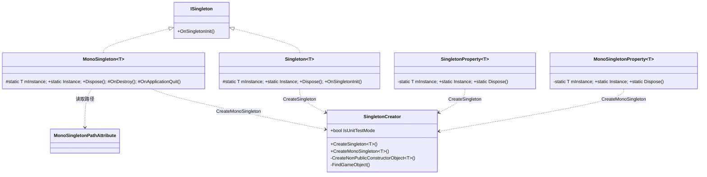
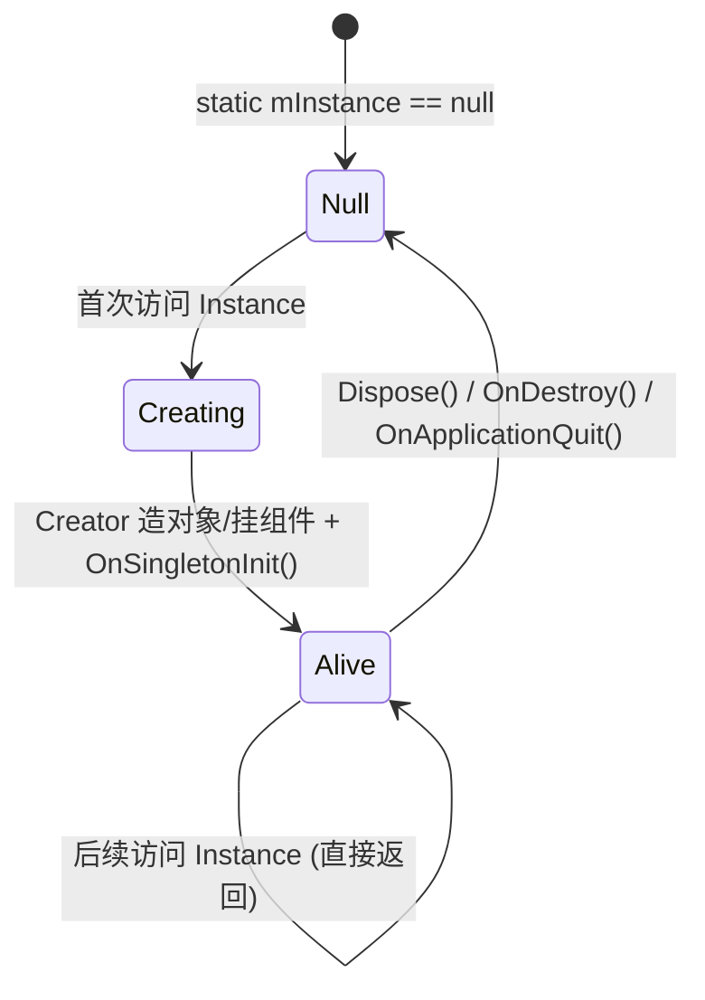
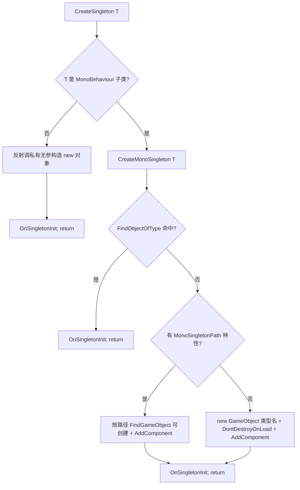

# 03 · SingletonKit 解析

> 源码（已读）：`_CoreKit/SingletonKit/Scripts/` 下
> `ISingleton.cs`、`Singleton.cs`、`SingletonProperty.cs`、`MonoSingleton.cs`、`MonoSingletonProperty.cs`、`MonoSingletonPath.cs`、`SingletonCreator.cs`。
> 未逐字读：`PersistentMonoSingleton.cs`、`ReplaceableMonoSingleton.cs`、`PrefabSingletonProperty.cs`、`ScriptableSingletonProperty.cs`（变体，机制同源，下文标注「未在本仓库逐字验证」）。

---

## 一、契约定义

### 核心类型清单

| 文件 | 类型 | 角色 | 可见性 |
|---|---|---|---|
| `ISingleton.cs` | `ISingleton` | 单例标记接口，强制实现 `OnSingletonInit()` | public |
| `Singleton.cs` | `Singleton<T>` | 纯 C# 单例基类（`where T:Singleton<T>`） | public abstract |
| `SingletonProperty.cs` | `SingletonProperty<T>` | 用**属性**而非继承提供纯 C# 单例（不占用基类位） | public static |
| `MonoSingleton.cs` | `MonoSingleton<T>` | MonoBehaviour 单例基类 | public abstract |
| `MonoSingletonProperty.cs` | `MonoSingletonProperty<T>` | 属性式 Mono 单例（不占基类位） | public static |
| `MonoSingletonPath.cs` | `MonoSingletonPathAttribute` | 指定单例 GameObject 在 Hierarchy 的路径/名 | public |
| `SingletonCreator.cs` | `SingletonCreator` | **所有单例的统一创建工厂**（反射 + 场景查找 + DontDestroyOnLoad） | internal static |

### 穿透语法的关键设计约束

1. **两种获取方式：继承式 vs 属性式**。`Singleton<T>`/`MonoSingleton<T>` 通过**继承**注入 `Instance`，简单但占用唯一的基类继承位；`SingletonProperty<T>`/`MonoSingletonProperty<T>` 通过**静态泛型类**提供 `Instance`，对象自己只需 `implements ISingleton`，**保留继承位**。这是同一目的的两套权衡（落地难点）。

2. **`SingletonCreator` 是唯一创建真相**。无论哪种入口，最终都走 `SingletonCreator.CreateSingleton<T>()` 或 `CreateMonoSingleton<T>()`。它在内部判断 `typeof(T)` 是否 `MonoBehaviour` 的子类，分流到"反射私有构造造纯 C# 对象"或"场景查找/创建 GameObject 挂组件"。

3. **纯 C# 单例靠反射调私有构造**。`CreateNonPublicConstructorObject<T>` 用 `BindingFlags.Instance|NonPublic` 找无参私有构造并 `Invoke`。**目的：强制单例的构造私有化**——外部 `new` 不了，只能走 `Instance`。这要求单例类提供 `private Xxx() {}`。

4. **Mono 单例的四级查找回退链**：`FindObjectOfType` → 有 `MonoSingletonPath` 特性则按路径 `FindGameObject`(可创建) → 仍无则 `new GameObject(类型名) + DontDestroyOnLoad + AddComponent`。保证"场景里已有就复用，没有就建"。

5. **线程锁仅在纯 C# 版**。`Singleton<T>`/`SingletonProperty<T>` 的 `Instance` getter 有 `lock(mLock)` 双检；Mono 版**没有锁**（Unity 主线程语义，且 `FindObjectOfType` 本就不可跨线程）。

6. **`IsUnitTestMode` 贯穿全程**。它影响：是否 `DontDestroyOnLoad`、`Dispose` 用 `DestroyImmediate` 还是 `Destroy`、`CreateMonoSingleton` 是否要求 `Application.isPlaying`。测试态绕过 Unity 运行时约束。

### Mermaid 类图

---

## 二、生命周期与内存

### 动词语义表

| 操作 | 做什么 | 内存影响 |
|---|---|---|
| `Singleton<T>.Instance` (首访) | `lock` 双检 → `SingletonCreator.CreateSingleton<T>()` → 反射造对象 → `OnSingletonInit()` | 分配一个 T 实例（堆） |
| `MonoSingleton<T>.Instance` (首访) | `CreateMonoSingleton<T>`：查场景→按路径→新建 GO+组件 → `OnSingletonInit()` | 可能分配 GameObject + 组件 |
| `OnSingletonInit()` | 子类初始化钩子，由 Creator 在实例就绪后调用一次 | 取决于实现 |
| `Singleton.Dispose()` | `mInstance=null`（纯 C#，靠 GC 回收旧对象） | 释放引用 |
| `MonoSingleton.Dispose()` | 测试态向上销毁整条父链 GameObject；运行态 `Destroy(gameObject)` | 销毁 GameObject |
| `MonoSingleton.OnDestroy()` | `mInstance=null`（GO 被销毁时自动） | 清引用 |
| `MonoSingleton.OnApplicationQuit()` | `Destroy(mInstance.gameObject)` + `mInstance=null` | 退出清理 |
| `MonoSingletonProperty.Dispose()` | `Destroy`/`DestroyImmediate` GO + `mInstance=null` | 销毁 GameObject |

### 状态机：单例实例

### 关键流程：SingletonCreator 的创建分流

> 穿透点：`CreateMonoSingleton` 开头 `if(!IsUnitTestMode && !Application.isPlaying) return null;`——编辑器非运行态访问 Mono 单例返回 null，防止在编辑模式误建脏 GameObject。这是 Unity 框架级单例必须处理的边界。

---

## 三、跨层桥接

### 核心层与上层如何对接

- **被 PoolKit 依赖**：`SafeObjectPool<T> : ISingleton`，其 `Instance => SingletonProperty<SafeObjectPool<T>>.Instance`。即"每种类型的安全池"本身是一个属性式单例。
- **被 ActionKit 依赖**：`ActionKitMonoBehaviourEvents : MonoSingleton<>`（带 `[MonoSingletonPath("QFramework/ActionKit/GlobalMonoBehaviourEvents")]`）、`ActionQueue` 走 `MonoSingletonProperty<ActionQueue>`。ActionKit 的全局 Update 驱动与延迟回收队列都靠 Mono 单例落地。
- **被业务层依赖**：GameManager/各种 Manager 通常 `MonoSingleton<T>`（推断，未逐一验证）。

### 注入点

| 注入点 | 机制 |
|---|---|
| `OnSingletonInit()` | 实例就绪后的初始化钩子（唯一保证调用一次的入口） |
| `MonoSingletonPathAttribute` | 声明式指定单例 GO 的 Hierarchy 路径与命名 |
| `SingletonCreator.IsUnitTestMode` | 全局开关，切换测试/运行时行为 |
| 私有构造函数 | 纯 C# 单例靠"提供私有无参构造"被反射创建 |

### 跨层 DTO / 快照

SingletonKit 不传递 DTO，它提供的是"全局唯一访问点"。语义上 `Instance` 本身就是一个进程级共享引用。

---

## 四、落地难点

1. **继承式 vs 属性式的取舍**：继承式（`MonoSingleton<T>`）写法最简但吃掉唯一继承位，若单例类已需继承别的基类就无解；属性式（`MonoSingletonProperty<T>`）保留继承位，但要求单例类**自己重复声明 `Instance`/`Dispose` 转发到属性类**。仿写时要理解"为什么需要两套"。

2. **反射私有构造 + `OnSingletonInit` 的初始化时序**：纯 C# 单例不能用公有构造（否则可被 `new` 破坏唯一性），靠反射 `BindingFlags.NonPublic` 调私有构造，再统一调 `OnSingletonInit`。把"构造"与"初始化"分离——构造只做对象分配，副作用放 `OnSingletonInit`，便于 Creator 统一控制时机。

3. **Mono 单例的查找回退链 + DontDestroyOnLoad + 测试态**：四级回退（FindObjectOfType→路径→新建）、跨场景存活、编辑器非运行态返回 null、测试态向上销毁父链——这些 Unity 特有边界是仿写 Mono 单例最容易遗漏的，直接决定单例在场景切换/编辑器下是否出 bug。

## 五、坐标

- **优先级**：P0（核心底座）。
- **依赖谁**：无（仅 UnityEngine + 反射）。
- **被谁依赖**：PoolKit（`SafeObjectPool`）、ActionKit（`ActionKitMonoBehaviourEvents`/`ActionQueue`）、几乎所有 Manager。
