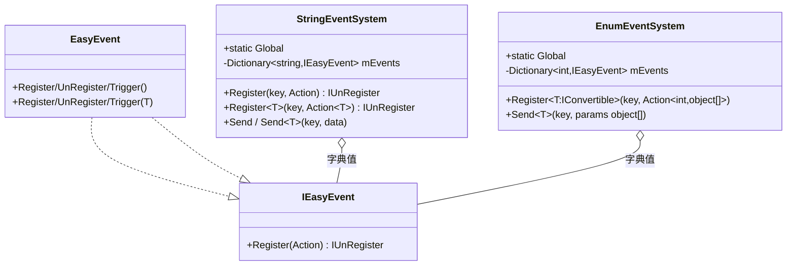
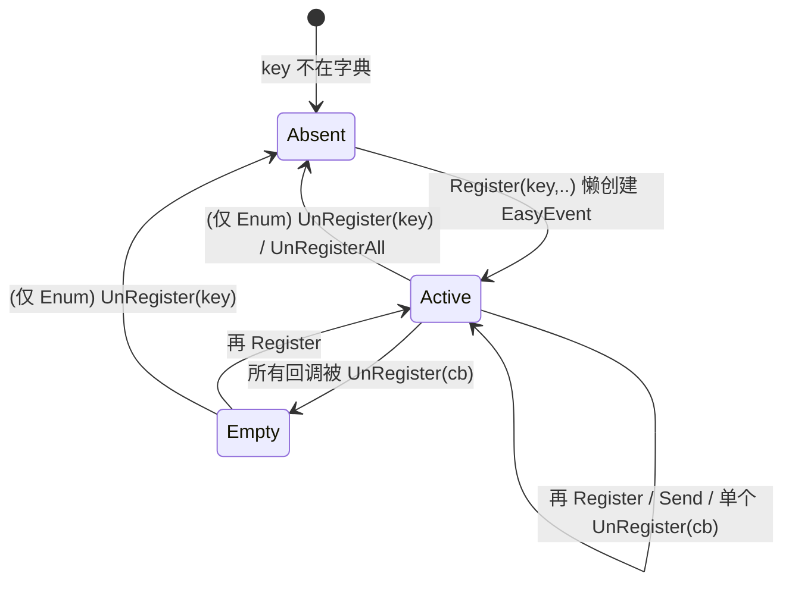
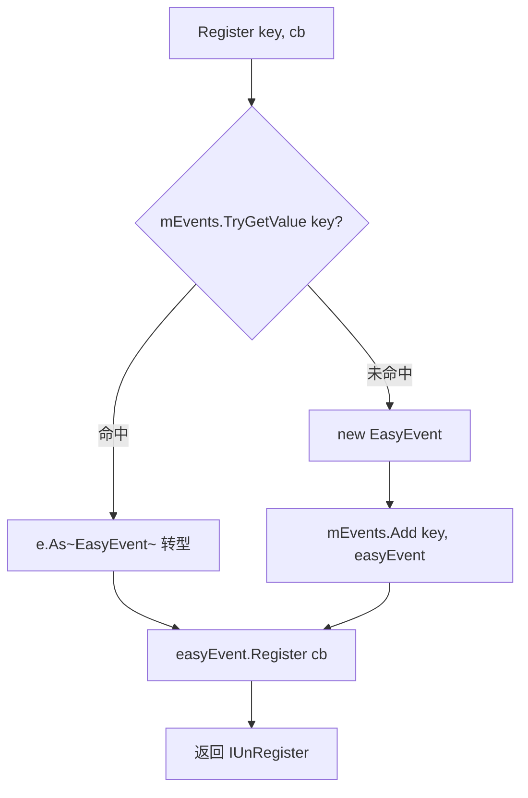

# 04 · EventKit 解析

> 源码（已读）：`_CoreKit/EventKit/EventSystem/StringEventSystem.cs`、`EnumEventSystem.cs`。
> 依赖核心母体 `QFramework.cs` 中的 `IEasyEvent` / `EasyEvent` / `EasyEvent<T>` / `EasyEvent<T,K>`。
> 另有 `EventTrigger/`（Mono/Physics/UI 触发器组件）与 `Component/`（OnSelect/OnDeselect UnityEvent），属于 Unity 事件包装，本解析聚焦两个事件系统主干，触发器组件标注「未逐字验证」。

---

## 一、契约定义

### 核心类型清单

| 文件 | 类型 | 角色 | 可见性 |
|---|---|---|---|
| `StringEventSystem.cs` | `StringEventSystem` | 以 **string** 为 key 的事件总线（`Global` 单例 + 可实例化） | public |
| `EnumEventSystem.cs` | `EnumEventSystem` | 以 **枚举（转 int）** 为 key 的事件总线 | public |
| (Core) | `IEasyEvent` / `EasyEvent` / `EasyEvent<T>` | 底层委托封装单元（被两个系统复用） | public |
| `StringEventSystem.cs` | `MsgDispatcher` 等 | 全部 `[Obsolete]` 兼容壳 | public（废弃） |
| `EnumEventSystem.cs` | `QEventSystem` | `[Obsolete]` 兼容壳 | public（废弃） |

### 穿透语法的关键设计约束

1. **EventKit 不发明事件单元，只做"key 化路由"**。两个系统都只是 `Dictionary<key, IEasyEvent>` + `.As<EasyEvent...>()` 转型，真正的注册/触发逻辑全在 Core 的 `EasyEvent`。EventKit = "字符串/枚举 → EasyEvent" 的查找表。

2. **三种事件系统的 key 维度对比（设计母题）**：
   - `TypeEventSystem`（Core）：key = **事件类型**，编译期类型安全，事件即 DTO。
   - `StringEventSystem`：key = **string**，灵活但无类型检查、payload 靠泛型 `T`。
   - `EnumEventSystem`：key = **枚举值**（`IConvertible.ToInt32`），payload 固定为 `Action<int, object[]>`。

3. **StringEventSystem 的"懒创建"路由**：`Register(key, onEvent)` 时若 key 不存在，`new EasyEvent()` 存入字典再注册；存在则 `e.As<EasyEvent>()` 转型后注册。**同一 key 必须始终用同一 payload 形态**——`Register(key)`（无参）与 `Register<T>(key, Action<T>)`（带参）混用同一 key 会因 `As<>` 转型失败而出问题（落地难点）。

4. **EnumEventSystem 的 key 归一化**：所有 API `where T : IConvertible`，内部 `key.ToInt32(null)` 把枚举转成 int 做字典 key。统一用 `EasyEvent<int, object[]>`，触发时回调收到 `(int keyValue, object[] args)`。这是老式"消息 ID + 变长参数"风格。

5. **`Send` 静默失败**：两个系统 `Send` 时若 key 不在字典中，直接 `?.` 跳过——**没有订阅者的事件被静默丢弃**，不报错、不缓存。

### Mermaid 类图

---

## 二、生命周期与内存

### 动词语义表（以 StringEventSystem 为例）

| 操作 | 做什么 | 内存影响 |
|---|---|---|
| `Register(key, cb)` | key 不存在→`new EasyEvent()`入字典；存在→`As<EasyEvent>()`；再 `Register(cb)` | 首注册某 key 时分配一个 EasyEvent；返回 `CustomUnRegister`（struct） |
| `Register<T>(key, cb)` | 同上但用 `EasyEvent<T>` | 同上 |
| `Send(key)` / `Send<T>(key, data)` | `TryGetValue`→`As<EasyEvent..>()?.Trigger()` | 无分配（key 不存在静默返回） |
| `UnRegister(key, cb)` | `TryGetValue`→`As<>()?.UnRegister(cb)`（委托 `-=`） | 不移除字典项（残留空 EasyEvent） |
| `EnumEventSystem.UnRegister<T>(key)` | `mEvents.Remove(kv)` —— **整 key 移除** | 释放该 key 的 EasyEvent |
| `EnumEventSystem.UnRegisterAll()` | `mEvents.Clear()` | 释放全部 |

> 关键不对称：`StringEventSystem` 只能注销单个回调、永不移除字典项；`EnumEventSystem` 额外提供 `UnRegister<T>(key)`（移除整个 key）和 `UnRegisterAll()`。

### 状态机：某个 key 的事件槽

### 关键流程：StringEventSystem.Register 的懒创建路由

---

## 三、跨层桥接

### 核心层与上层如何对接

- **建立在 Core 之上**：两个系统的字典值类型 `IEasyEvent` 与具体 `EasyEvent/EasyEvent<T>` 全来自 `QFramework.cs`。EventKit 是 Core 事件单元的"应用封装"，提供 type 之外的两种 key 维度。
- **与 Architecture 的关系**：Architecture 内部用的是 `TypeEventSystem`（type key），不是 EventKit 的 String/Enum 系统。EventKit 更多用于"不想为每个事件定义类型"的轻量/跨模块松耦合广播场景。

### 注入点

| 注入点 | 机制 |
|---|---|
| `StringEventSystem.Global` / `EnumEventSystem.Global` | 进程级全局总线（静态只读单例） |
| 自行 `new StringEventSystem()` | 局部作用域事件总线（如单个系统内部） |
| `.As<T>()`（FluentAPI 扩展） | 字典里 `IEasyEvent` → 具体事件类型的转型注入点 |

### 跨层 DTO / 快照

- String 版：payload 是泛型 `T`（`Send<T>(key, data)`），DTO 由调用方定义，类型靠约定。
- Enum 版：payload 固定 `object[] args` + key 的 int 值，是"消息 ID + 变长 object 参数"的弱类型 DTO，接收方需自行强转 `args[i]`。

---

## 四、落地难点

1. **同一 key 的 payload 形态一致性**：`StringEventSystem` 用 `As<EasyEvent>()` / `As<EasyEvent<T>>()` 强转字典值。若先 `Register("evt", Action)`（无参 EasyEvent），又 `Register<int>("evt", Action<int>)`，第二次会把字典里的 `EasyEvent` 当 `EasyEvent<int>` 转型——转型失败/拿到 null 引发隐蔽 bug。仿写时要么禁止混用，要么在 key 上编码类型。

2. **弱类型 key 的可维护性代价**：string/enum key 没有编译期检查，`Send` 找不到 key 还静默失败。大型项目里魔法字符串散落、拼写错误、payload 类型错配都不会报错，只是"事件没反应"。这是选择 EventKit 而非 `TypeEventSystem` 时必须权衡的工程成本。

3. **注销与字典清理的不对称**：String 版永不移除空 key（轻微泄漏 + 残留空壳），Enum 版能整 key 移除。仿写时要明确"单回调注销"与"整 key 销毁"是两种语义，按需提供。

## 五、坐标

- **优先级**：P1（建立在 Core 之上的应用封装）。
- **依赖谁**：CoreArchitecture（`IEasyEvent`/`EasyEvent`）、FluentAPI（`.As<>()`）。
- **被谁依赖**：需要弱类型/跨模块松耦合广播的业务代码（推断）。
