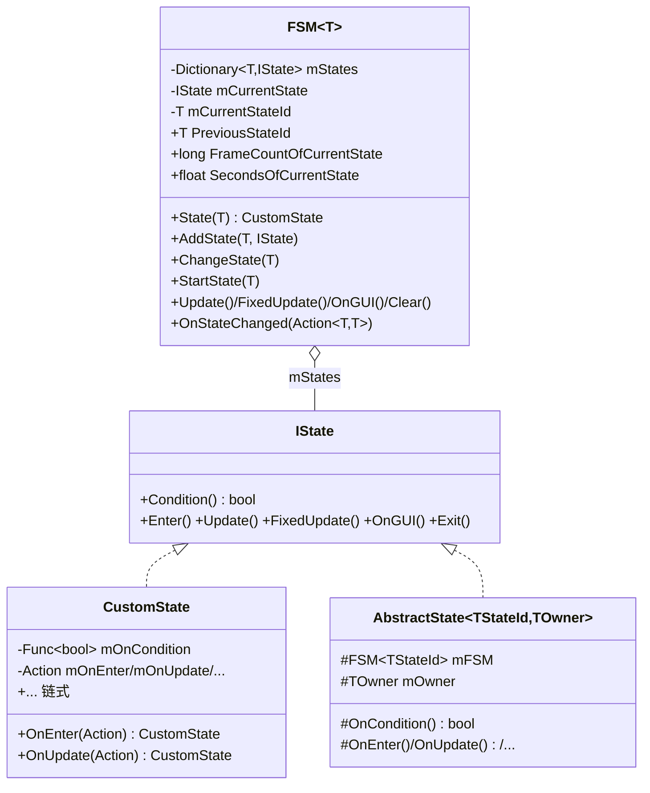
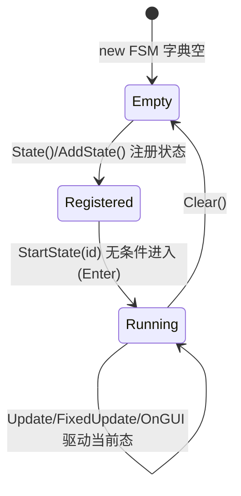
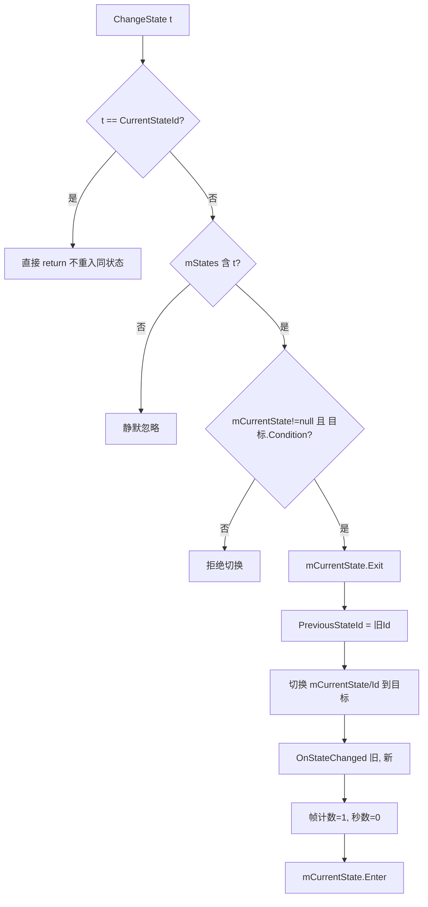

# 05 · FSMKit 解析

> 源码（全部已读）：`_CoreKit/FSMKit/IState.cs`（453 行，含大段示例特性）。
> 实质代码很短：`IState` 接口 + `CustomState`（链式建造）+ `FSM<T>`（状态容器/驱动）+ `AbstractState<TStateId,TOwner>`（类式状态基类）。

---

## 一、契约定义

### 核心类型清单

| 类型 | 角色 | 可见性 |
|---|---|---|
| `IState` | 状态契约：`Condition()` + `Enter/Update/FixedUpdate/OnGUI/Exit()` | public |
| `CustomState` | 链式委托状态（`OnEnter`/`OnUpdate`/... 注入回调） | public |
| `FSM<T>` | 状态机：`Dictionary<T,IState>` 容器 + 当前状态 + 切换驱动 | public |
| `AbstractState<TStateId,TOwner>` | 类式状态基类，持 `mFSM` + `mOwner`，重写 `On*` | public abstract |

### 穿透语法的关键设计约束

1. **两种定义状态的风格混用**：`FSM.State(id).OnEnter(...).OnUpdate(...)`（链式委托，轻量）与 `FSM.AddState(id, new MyState(fsm, owner))`（类式继承 `AbstractState`，重量但可复用/带 owner 上下文）。**同一个 FSM 可混用两种**（`State()` 走 CustomState，`AddState()` 走任意 IState）。

2. **`Condition()` 是切换的守门员**：`ChangeState(t)` 只有在 `目标状态.Condition()` 返回 true 时才执行切换。这把"允许从当前状态切到目标状态"的合法性判断下放给**目标状态自己**（而非维护一张转移表）。`CustomState.Condition` 默认 true（`mOnCondition==null || result.Value`）。

3. **切换的原子序列**：`ChangeState` 内 `Exit旧 → 记 PreviousStateId → 换 mCurrentState/Id → 触发 OnStateChanged → 重置帧/秒计数 → Enter新`。顺序固定：先退出旧、后进入新，中间广播变更。

4. **`State(t)` 的"获取或创建"语义**：`State(id)` 若已存在则 `as CustomState` 返回（**注意：若该 id 此前是 AbstractState，`as CustomState` 会得 null**），否则 new 一个 CustomState 存入。这是链式 API 的入口，兼具注册与查询（落地难点）。

5. **内建运行时计量**：`FrameCountOfCurrentState`（long）与 `SecondsOfCurrentState`（float）在每次 `Update` 累加、切换时归零。状态可据此实现"停留 N 秒后自动转移"。

6. **`StartState` vs `ChangeState` 的差异**：`StartState` 是无条件首次进入（不检查 Condition、不调 Exit、不触发 OnStateChanged，帧计数置 0）；`ChangeState` 是带条件的运行时切换（检查 Condition、调 Exit、触发 OnStateChanged、帧计数置 1）。

### Mermaid 类图

---

## 二、生命周期与内存

### 动词语义表

| 操作 | 做什么 | 内存影响 |
|---|---|---|
| `State(id)` | 有则 `as CustomState` 返回；无则 `new CustomState` 入字典 | 首次为该 id 分配一个 CustomState |
| `AddState(id, state)` | `mStates.Add(id, state)` | 存入外部传入的 IState（重复 id 会抛 `ArgumentException`） |
| `StartState(id)` | 无条件设为当前态，帧计数=0，调 `Enter()` | 无分配 |
| `ChangeState(id)` | 同 id 直接 return；否则检查 `Condition()`，通过则 Exit→换→广播→Enter | 无分配 |
| `Update()` | `mCurrentState?.Update()` + 帧计数++ + 秒数累加 | 无分配 |
| `FixedUpdate()/OnGUI()` | 转发给当前状态 | 无分配 |
| `OnStateChanged(cb)` | `mOnStateChanged += cb`（多播委托） | 委托链增长 |
| `Clear()` | `mCurrentState=null` + `mCurrentStateId=default` + `mStates.Clear()` | 释放所有状态引用 |

> FSMKit **不使用对象池**，状态对象由 `State()`/`AddState()` 创建后常驻 `mStates` 字典，直到 `Clear()`。状态是"长生命周期、可复用"的，每帧切换不产生 GC。

### 状态机：FSM 自身的运行状态

### 关键流程：ChangeState 的条件切换

> 穿透点：`Condition()` 检查的是**目标状态**的条件。示例里 `FSM.State(States.A).OnCondition(()=>FSM.CurrentStateId == States.B)` 表示"只有当前在 B 时才允许进入 A"——即把"谁能进我"的规则写在目标状态上，等价于反向的转移约束。

---

## 三、跨层桥接

### 核心层与上层如何对接

- **完全独立的底座**：FSMKit 不依赖任何其他 Kit（仅 `UnityEngine.Time.deltaTime`、`Debug`）。它由上层（通常 MonoBehaviour）在 `Update/FixedUpdate/OnGUI/OnDestroy` 中手动驱动 `FSM.Update()` 等。
- **驱动方式**：典型用法是 MonoBehaviour 持有 `FSM<States>` 字段，在自身生命周期回调里转发。FSM 本身不订阅 Unity 生命周期，**驱动权在外部**——这与 ActionKit（自带全局 Mono 驱动）形成对比。

### 注入点

| 注入点 | 机制 |
|---|---|
| `CustomState.On*(Action)` | 链式注入每个生命周期回调 |
| `AbstractState` 的 `OnCondition/OnEnter/...` 重写 | 类式注入 + 通过 `mOwner` 注入外部上下文 |
| `FSM.OnStateChanged(Action<T,T>)` | 状态变更的旁路观察（多播） |

### 跨层 DTO / 快照

- `CurrentStateId` / `PreviousStateId` / `FrameCountOfCurrentState` / `SecondsOfCurrentState` 都是**可读快照**，供状态逻辑或外部 UI 查询当前机器状态。
- `OnStateChanged(prev, next)` 回调把"状态迁移"作为事件广播，prev/next 是迁移快照。

---

## 四、落地难点

1. **`State(id)` 的 `as CustomState` 陷阱**：`State()` 返回 `mStates[t] as CustomState`。如果该 id 之前用 `AddState(id, new MyAbstractState(...))` 注册过（非 CustomState），`as` 会返回 **null**，后续链式调用 `.OnEnter()` 直接 NRE。仿写/使用时必须清楚"`State()` 只对 CustomState 安全"。

2. **`Condition` 语义的方向**：守门规则写在"目标状态"上而非"当前状态"上，也不是一张集中的转移表。优点是状态自治、易增删；缺点是迁移逻辑分散，难以一眼看全状态图。仿写时要决定采用"目标自检"还是"集中转移表"——这是两种 FSM 哲学。

3. **驱动责任在外部 + Clear 的释放**：FSM 不自动 Update，漏调 `FSM.Update()` 则状态的 `OnUpdate` 永不执行；漏调 `FSM.Clear()`（通常在 `OnDestroy`）则状态对象（可能捕获了 owner/场景引用）随 FSM 字段存活。`StartState` 与 `ChangeState` 帧计数初值不同（0 vs 1）也是易错细节。

## 五、坐标

- **优先级**：P1（独立底座，无依赖）。
- **依赖谁**：无（仅 UnityEngine 基础）。
- **被谁依赖**：PackageKit 的 Login 模块用了 `State/`（推断），以及任意需要状态管理的业务（推断，未逐一验证）。
