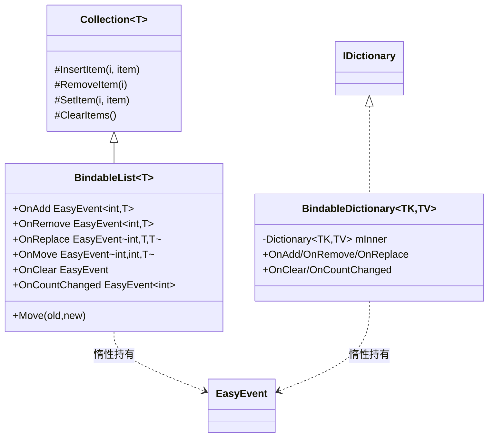
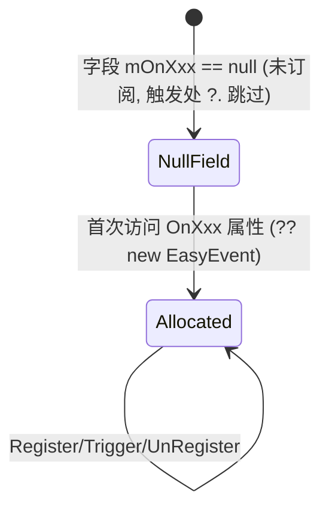
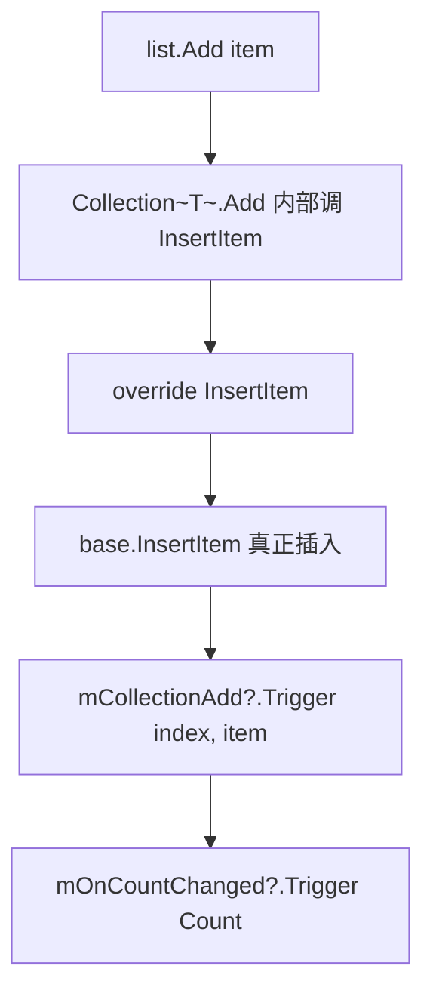

# 06 · BindableKit 解析

> 源码（已读）：`_CoreKit/BindableKit/Scripts/BindableList.cs`、`BindableDictionary.cs`。
> 依赖 Core 母体的 `EasyEvent`/`EasyEvent<T..>`。`BindableProperty<T>` 本体在 `QFramework.cs`（见 01 CoreArchitecture），BindableKit 此处提供的是"响应式集合"。
> 另有 `PlayerPrefs*Property.cs`、`EditorPrefsBoolProperty.cs`（持久化型 BindableProperty 变体），标注「未逐字验证」。

---

## 一、契约定义

### 核心类型清单

| 文件 | 类型 | 角色 | 可见性 |
|---|---|---|---|
| `BindableList.cs` | `BindableList<T>` | 继承 `Collection<T>`，重写增删改触发事件 | public |
| `BindableDictionary.cs` | `BindableDictionary<TKey,TValue>` | 包装 `Dictionary`，实现 `IDictionary` 全套接口 + 事件 | public |
| (Core) | `BindableProperty<T>` | 单值可观测属性（值变更去重 + Trigger） | public |
| `*Extensions` | `ToBindableList` / `ToBindableDictionary` | 从普通集合转换 | public static |

### 穿透语法的关键设计约束

1. **两种"挂事件"的手法**：
   - `BindableList<T> : Collection<T>` —— **继承 + 重写**。`Collection<T>` 把所有写操作收敛到 `InsertItem/RemoveItem/SetItem/ClearItem/MoveItem` 五个 protected 虚方法，子类只需重写这五个就能拦截所有变更（这是 BCL 设计的精妙复用点）。
   - `BindableDictionary` —— **包装 + 转发**。内部持 `Dictionary mInner`，自己实现 `IDictionary` 全部成员，在写方法里手动 Trigger（因为 `Dictionary` 没有可重写的虚写入方法）。

2. **事件全部惰性创建（零成本订阅前不分配）**：每个事件字段都 `[NonSerialized] private EasyEvent<...> mOnXxx;` + 属性 `OnXxx => mOnXxx ?? (mOnXxx = new ...)`。**不订阅就不分配事件对象**，触发处用 `?.Trigger()` 跳过未创建的事件。这是高频集合操作的内存优化（落地难点）。

3. **细粒度变更事件**：不是"集合变了"一个粗事件，而是 `OnAdd(index/key, item)`、`OnRemove`、`OnReplace(index, old, new)`、`OnMove(old, new, item)`、`OnClear`、`OnCountChanged`。订阅者能精确知道"发生了什么、在哪、新旧值"——支撑 UI 增量刷新（只更新变化的那一项，而非整列表重建）。

4. **`OnCountChanged` 的条件触发**：`ClearItems`/`Clear` 里 `if(beforeCount>0) mOnCountChanged?.Trigger(Count)`——空集合再 Clear 不触发数量变更（数量没变）。`SetItem`/`this[key]=`（替换已有）只触发 `OnReplace`，**不触发** `OnCountChanged`（数量未变）。

5. **`[Serializable]` + `[NonSerialized]` 事件**：集合数据可被 Unity 序列化（`BindableList` 标 `[Serializable]`），但事件委托标 `[NonSerialized]` 不参与序列化——避免序列化回调链导致的问题。

### Mermaid 类图

---

## 二、生命周期与内存

### 动词语义表（BindableList）

| 操作（公有 API） | 收敛到的虚方法 | 触发的事件 | 数量变化 |
|---|---|---|---|
| `Add(item)` / `Insert(i,item)` | `InsertItem` | `OnAdd(i,item)` + `OnCountChanged` | +1 |
| `Remove`/`RemoveAt(i)` | `RemoveItem` | `OnRemove(i,item)` + `OnCountChanged` | −1 |
| `this[i] = x` | `SetItem` | `OnReplace(i, old, new)` | 不变（**不触发 Count**） |
| `Move(old,new)` | `MoveItem` | `OnMove(old,new,item)` | 不变 |
| `Clear()` | `ClearItems` | `OnClear` + (若原本非空)`OnCountChanged` | 归零 |

### 动词语义表（BindableDictionary）

| 操作 | 触发的事件 |
|---|---|
| `Add(k,v)` | `OnAdd(k,v)` + `OnCountChanged` |
| `this[k]=v`（k 已存在） | `OnReplace(k, old, new)`（**不触发 Count**） |
| `this[k]=v`（k 不存在） | `OnAdd(k,v)` + `OnCountChanged` |
| `Remove(k)`（存在且成功） | `OnRemove(k, old)` + `OnCountChanged` |
| `Clear()` | `OnClear` + (若原本非空)`OnCountChanged` |

### 状态机：单个事件字段的惰性生命周期

### 关键流程：BindableList.Add 的事件路由

> 穿透点：开发者调用的是普通 `List` 风格 API（`Add`/`RemoveAt`/`this[i]`），但因为继承自 `Collection<T>`，这些调用被 BCL 收敛到五个虚方法，子类一处重写即覆盖所有入口。**这就是为什么 `BindableList` 能完整拦截而不必重写每个公有方法**。

---

## 三、跨层桥接

### 核心层与上层如何对接

- **建立在 Core EasyEvent 之上**：所有事件字段都是 `EasyEvent`/`EasyEvent<...>`。BindableKit 把"集合变更"翻译成"细粒度事件"，是 Core 事件单元的应用。
- **典型用于 Model 层**：`AbstractModel` 里放 `BindableList<Item> Inventory`，View 订阅 `Inventory.OnAdd/OnRemove` 做增量 UI 刷新。数据流：Command 改 Model 的集合 → 集合 Trigger 细粒度事件 → View 增量更新。

### 注入点

| 注入点 | 机制 |
|---|---|
| `OnAdd/OnRemove/OnReplace/OnMove/OnClear/OnCountChanged` | 订阅集合变更（返回 `IUnRegister`，可绑生命周期） |
| `BindableProperty<T>.Comparer`（Core） | 单值去重策略 |
| `ToBindableList/ToBindableDictionary` | 从既有集合转换的注入点 |

### 跨层 DTO / 快照

- 事件参数即变更快照：`OnReplace(index, oldItem, newItem)` 携带新旧值，`OnAdd(index, item)` 携带位置与元素。订阅者据此做精确的增量同步。
- `Count` 是可读快照，`OnCountChanged(Count)` 推送新数量。

---

## 四、落地难点

1. **靠 `Collection<T>` 五虚方法收敛所有写入**：这是 `BindableList` 能"一处重写、全面拦截"的关键。若不知道 `Collection<T>` 的设计，直接继承 `List<T>`（其方法非虚）就无法拦截 `Add`，只能重写每个方法或包装——`BindableDictionary` 正因 `Dictionary` 无虚写方法，才不得不走"包装 + 实现完整 IDictionary"的笨重路线。仿写时要理解这两种手法的适用边界。

2. **惰性事件 + `?.Trigger` 的内存/性能平衡**：集合操作极高频，若每个 `BindableList` 一创建就 new 6 个 EasyEvent，开销巨大。惰性 + 空判跳过让"无人订阅的事件零成本"。仿写时必须在"触发处"也用 `?.`，否则惰性失去意义（一访问就分配）。

3. **替换不改数量的语义一致性**：`SetItem`/字典 `this[k]=`（替换）只触发 `OnReplace` 不触发 `OnCountChanged`；`Clear` 空集合不触发 `OnCountChanged`。这套"只在真正变化时通知"的精确语义，是 UI 不做无谓刷新的前提。仿写最易错点是无脑在所有写操作后都 Trigger CountChanged。

## 五、坐标

- **优先级**：P1（建立在 Core 之上的应用封装）。
- **依赖谁**：CoreArchitecture（`EasyEvent`、`BindableProperty`）。
- **被谁依赖**：Model 层数据建模、UIKit 的数据绑定（推断）。
