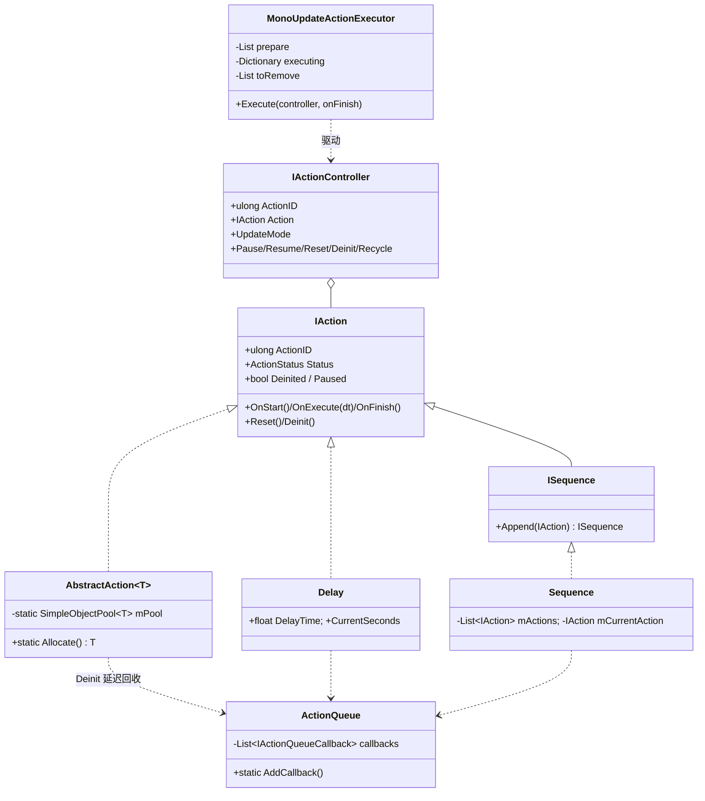
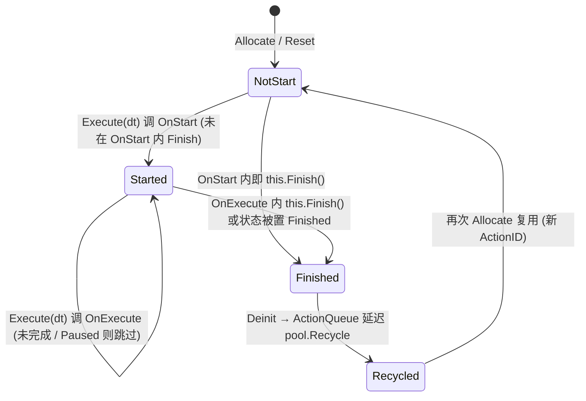
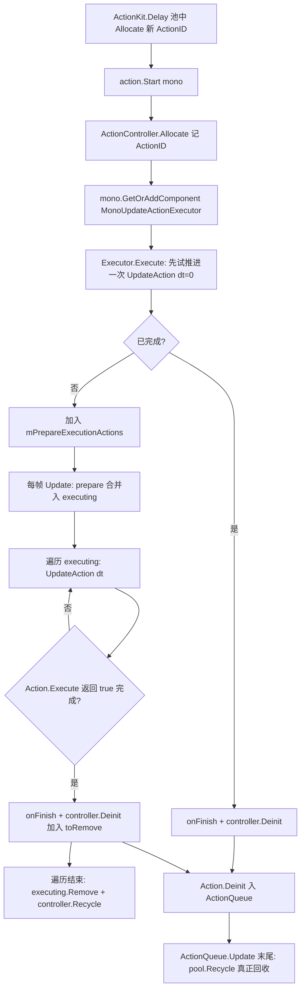

# 07 · ActionKit 解析

> 源码（已读）：`Framework/IAction.cs`、`Framework/IActionExecutor.cs`、`Internal/Action/{Delay,Sequence}.cs`、`Internal/Executor/MonoUpdateActionExecutor.cs`、`Internal/Queue/MonoActionQueue.cs`、`Internal/ActionKitMonoBehaviourEvents.cs`、`ActionKit.cs`（门面）。
> 未逐字读但机制同源：`Internal/Action/{Callback,Condition,Repeat,Parallel,Custom,Coroutine,Task,Lerp,DelayFrame,ConditionSequence}.cs`（标注「未逐字验证」，下文涉及处会说明依据）。`DeprecateActionKit.cs`（1783 行旧 API）跳过。

---

## 一、契约定义

### 核心类型清单

| 文件 | 类型 | 角色 | 可见性 |
|---|---|---|---|
| `ActionKit.cs` | `ActionKit : Architecture<ActionKit>` | 静态门面：`Delay/Sequence/Parallel/Repeat/Custom/Coroutine/Task` + 生命周期 `OnUpdate` 等 + `ID_GENERATOR` | public partial |
| `IAction.cs` | `IAction<TStatus>` / `IAction` | 动作契约：`OnStart/OnExecute(dt)/OnFinish` + `Status`/`Deinited`/`Paused` | public |
| | `AbstractAction<T>` | 池化动作基类（CRTP + `SimpleObjectPool` + `Allocate`） | public abstract |
| | `IActionController` / `ActionController` | 动作的"遥控器"：持 `ActionID` 做防错校验，可 Pause/Resume/Reset | public |
| | `IActionExtensions` | `Start(mono)` / `Finish` / `Execute(dt)` 状态机推进 | public static |
| `IActionExecutor.cs` | `IActionExecutor` + `UpdateAction` 扩展 | 执行器契约 + 单步推进/回收逻辑 | public |
| `MonoUpdateActionExecutor.cs` | `MonoUpdateActionExecutor : MonoBehaviour` | 把动作挂到某 GameObject 的 Update 上驱动 | internal |
| `MonoActionQueue.cs` | `ActionQueue` + `ActionQueueRecycleCallback<T>` | **延迟回收队列**（迭代安全） | internal |
| `Sequence.cs` | `ISequence` / `Sequence` | 串行组合动作 | public/internal |
| `Delay.cs` | `Delay` | 延时动作 | internal |

### 穿透语法的关键设计约束

1. **组合模式 + 命令模式 + 建造者模式**（门面注释明示）：`IAction` 是命令；`Sequence`/`Parallel` 是组合（持 `List<IAction>`，自身也是 `IAction`，可嵌套）；`ActionKit.Sequence().Delay(1).Callback(...)` 是建造者链式拼装。**组合节点与叶子节点统一为 `IAction`**，所以 Sequence 里能放 Sequence。

2. **三态状态机驱动**：`ActionStatus { NotStart, Started, Finished }`。推进逻辑集中在 `IActionExtensions.Execute(dt)`：NotStart→调 `OnStart`（若 OnStart 内即 Finish 则直接收尾）→Started；Started→`OnExecute(dt)`→检查是否 Finished；Finished→`OnFinish` 返回 true。**所有动作共用这一套推进，子类只填 `OnStart/OnExecute/OnFinish`**。

3. **池化复用 + 全局自增 ID（防悬挂引用的核心不变量）**：每种动作有 `static SimpleObjectPool<T>`，`Allocate()` 时从池取 + `ActionID = ActionKit.ID_GENERATOR++`。`ActionController` 启动时记下当时的 `ActionID`，之后所有操作（Reset/Pause/Deinit）都先校验 `Action.ActionID == ActionID`——**因为对象会被回收复用，同一个 IAction 实例可能已是"另一个动作"，ID 比对确保不误操作复用后的对象**（落地难点 No.1）。

4. **延迟回收：ActionQueue 解决"迭代中销毁"**：`Deinit()` 不直接 `pool.Recycle`，而是 `ActionQueue.AddCallback(new ActionQueueRecycleCallback<T>(pool, this))`，把回收推迟到 `ActionQueue.Update` 末尾统一执行。**避免在 Executor 遍历 `mExecutingActions` 的过程中修改池/集合**（迭代安全母题）。

5. **执行器的双缓冲增删**：`MonoUpdateActionExecutor` 用 `mPrepareExecutionActions`（待加入）+ `mExecutingActions`（执行中字典）+ `mToActionRemove`（待移除）三个集合。新动作先入 prepare、下帧合并进 executing；完成的先入 remove、遍历结束后统一删除并 `controller.Recycle()`。**绝不在 foreach 中直接增删字典**（迭代安全母题）。

6. **Deinit 的幂等 + 级联**：`Deinited` 标志防重复 Deinit；`Sequence.Deinit` 会 `foreach action.Deinit()` 级联回收子动作 + `mActions.Clear()` + 自身入回收队列。组合动作负责回收其持有的所有子动作。

### Mermaid 类图

---

## 二、生命周期与内存

### 动词语义表

| 操作 | 做什么 | 内存影响 |
|---|---|---|
| `ActionKit.Delay(s, cb)` | `Delay.Allocate`：从池取 + 新 `ActionID` + Reset + 设参 | 池空时 new，否则复用 |
| `action.Start(mono, onFinish)` | `ActionController.Allocate` + 记 ActionID + `ExecuteByUpdate` 挂到 mono 的 Executor | 复用 controller（池）+ 可能 AddComponent Executor |
| `Execute(dt)`（扩展） | 三态推进：NotStart→OnStart；Started→OnExecute；Finished→OnFinish | 无分配 |
| `action.Finish()`（扩展） | 仅置 `Status = Finished`（下次 Execute 时收尾） | 无 |
| `Deinit()` | 幂等：置 Deinited + OnDeinit + **入 ActionQueue 延迟回收** | 不立即回收，下帧 ActionQueue.Update 才 `pool.Recycle` |
| `controller.Recycle()` | controller 自身归还其池 | 复用 |
| `Pause/Resume` | 校验 ActionID 后置 `Action.Paused` | 无 |
| `Sequence.Append(a)` | `mActions.Add(a)`（`mActions` 来自 `ListPool<IAction>.Get()`） | 复用 List |
| `Sequence.Deinit` | 级联 `子.Deinit()` + `mActions.Clear()` + 自身入回收队列 | 级联回收 |

### 状态机：单个 IAction 的状态流转

### 关键流程：从 Start 到回收的完整链路

> 穿透点：`Deinit` 与真正 `Recycle` 分两帧/两阶段完成。`controller.Deinit()` 把 action 标记 Deinited 并塞进 `ActionQueue` 的回调列表；`ActionQueue.Update` 在它自己的 Update 里清空回调真正 `pool.Recycle`。这套延迟保证了"正在被 Executor 遍历的 action"不会在遍历途中被归还到池里复用，杜绝迭代期的状态错乱。

---

## 三、跨层桥接

### 核心层与上层如何对接

- **依赖 PoolKit**：每个动作类型 `static SimpleObjectPool<T>`（叶子如 `Delay`、组合如 `Sequence`、`ActionController`、Executor 的 `ActionTask` 都池化）。
- **依赖 SingletonKit**：`ActionKitMonoBehaviourEvents : MonoSingleton<>`（全局 Update/Fixed/GUI/生命周期事件源）、`ActionQueue` 走 `MonoSingletonProperty<ActionQueue>`。
- **依赖 Core EasyEvent**：`ActionKit.OnUpdate` 等暴露 `ActionKitMonoBehaviourEvents` 的 `EasyEvent`，让外部 `ActionKit.OnUpdate.Register(...)` 订阅全局 Update。
- **驱动绑定到调用方 mono**：`action.Start(this)` 把动作挂到 `this` 这个 MonoBehaviour 的 Executor 组件上——动作随该 GameObject 的 Update 驱动、随其销毁停止。还有 `StartGlobal`（挂全局单例）和 `StartCurrentScene`（挂场景组件）两种宿主。

### 注入点

| 注入点 | 机制 |
|---|---|
| `ActionKit.Custom(a => a.OnStart().OnExecute().OnFinish())` | 用委托注入完全自定义动作（无需建类） |
| `onFinish` 回调（`Start` 参数） | 动作完成时的外部回调 |
| `IActionController.IgnoreTimeScale()` | 切 `UpdateMode` 为 UnscaledDeltaTime |
| `ActionKit.OnUpdate/OnFixedUpdate/...` | 订阅全局 Mono 生命周期事件 |
| `IObjectFactory`（经 PoolKit） | 动作对象的创建策略 |

### 跨层 DTO / 快照

- `IActionController` 是动作的"外部句柄/快照引用"，持 `ActionID` 做版本校验；外部通过它 Pause/Resume/Reset 而不直接碰 action。
- `ActionStatus` 是动作执行进度的可读快照。
- `Custom<TData>` 允许动作携带自定义 `Data`（`a.Data`），是动作内部状态的 DTO（依据：门面 `Custom<TData>` 示例代码，未逐字读实现）。

---

## 四、落地难点

1. **池化 + ActionID 版本校验（最核心、最难）**：因为动作对象被回收复用，一个 `IActionController` 持有的 `IAction` 引用可能已被回收并 `Allocate` 成"别的动作"。框架用全局自增 `ID_GENERATOR` 给每次 `Allocate` 打唯一 ID，`controller` 记下启动时的 ID，所有操作前 `if(Action.ActionID == ActionID)` 校验。仿写时若省掉这层校验，Pause 一个早已完成回收复用的 controller 会误暂停一个无关的新动作——这是池化 + 长生命周期句柄的经典陷阱。

2. **延迟回收（ActionQueue）实现迭代安全**：`Deinit` 把回收动作塞进 `ActionQueue` 的回调列表，由 `ActionQueue.Update` 末尾统一执行 `pool.Recycle`。这样在 Executor 遍历执行中集合、或 Sequence 级联 Deinit 子动作的过程中，对象不会被立即归还池中复用，避免"边遍历边改池"的崩溃/错乱。与之配套，Executor 自身用 prepare/executing/toRemove 三集合双缓冲增删。**这是全框架"迭代安全增删"母题最典型的实现**。

3. **三态推进逻辑的边界（OnStart 内即完成）**：`Execute` 在 NotStart 调 `OnStart` 后**立即**检查 `Status==Finished`——支持"瞬时完成"的动作（如条件已满足的 Condition）。Sequence 的 `TryExecuteUntilNextNotFinished` 正是利用这点，用 `Execute(0)` 把一连串瞬时完成的子动作一次性推完，直到遇到第一个未完成的。漏掉这个"OnStart 后即查 Finish"会让瞬时动作多耗一帧、或 Sequence 卡住。

## 五、坐标

- **优先级**：P1（组合层，依赖三个底座）。
- **依赖谁**：PoolKit（重度）、SingletonKit（Mono 驱动 + 队列）、CoreArchitecture（EasyEvent；门面继承 `Architecture<ActionKit>`）。
- **被谁依赖**：UIKit 转场/动画、业务时序逻辑、`ScreenTransition`（推断）。
