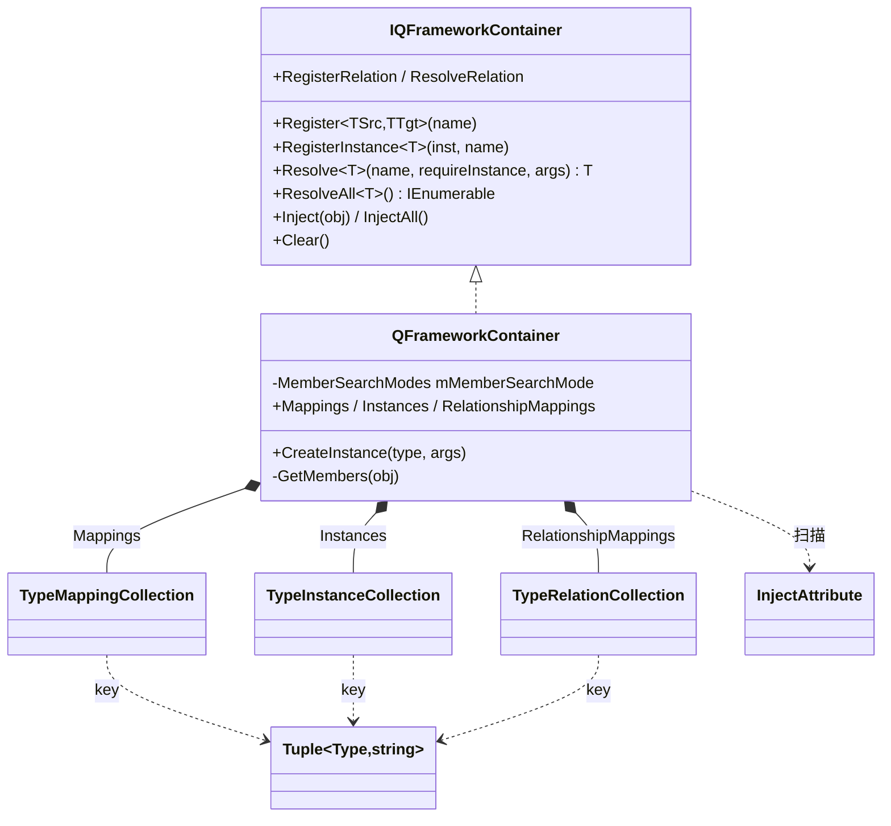
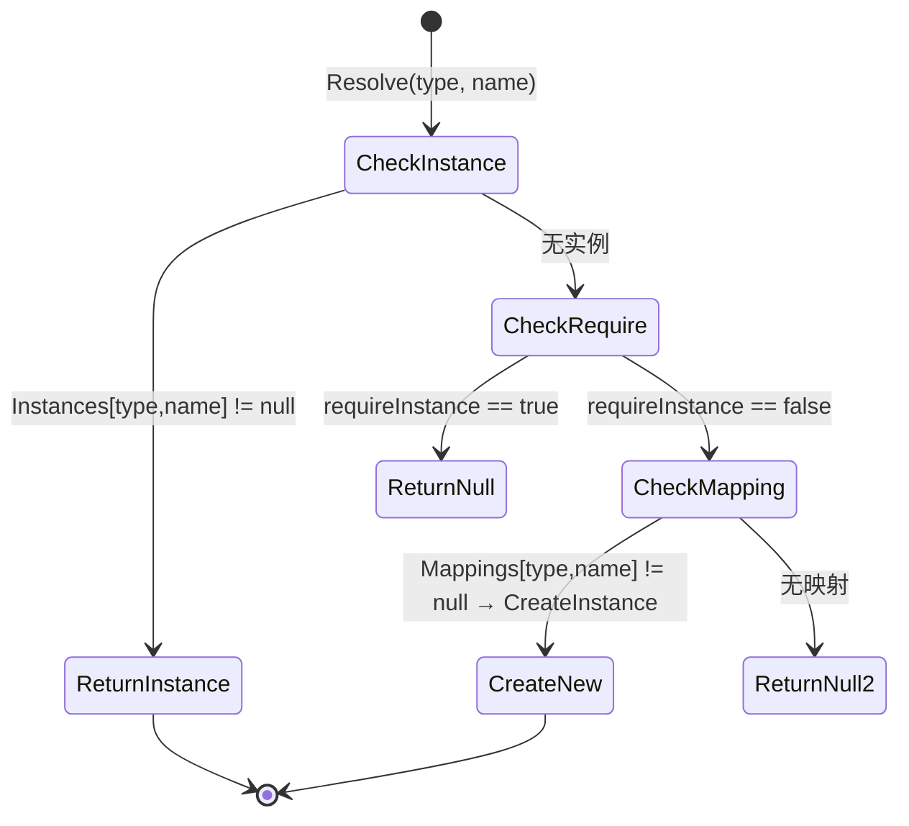
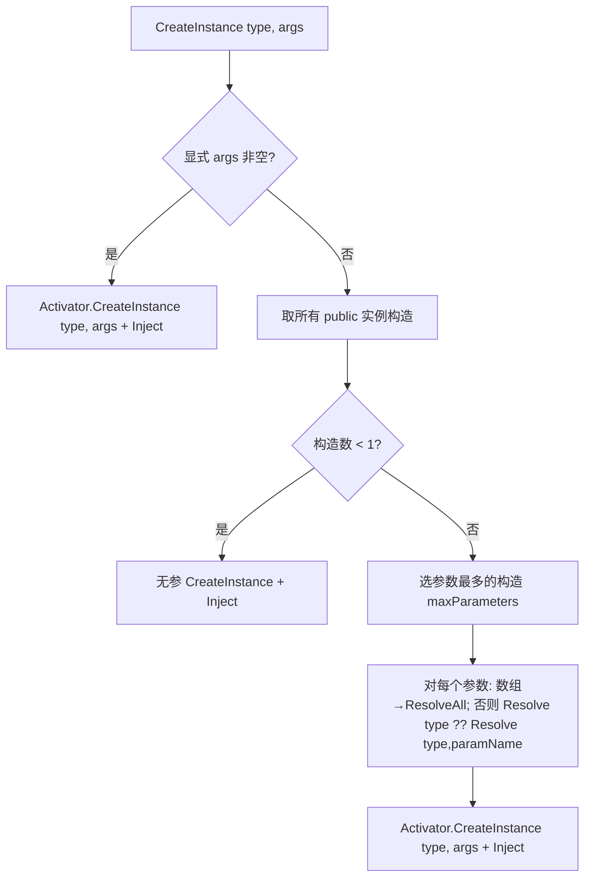

# 08 · IOCKit 解析

> 源码（全部已读）：`_CoreKit/IOCKit/IOCKit.cs`（507 行单文件）。
> ⚠️ 重要：IOCKit 与 CoreArchitecture 里的 `IOCContainer` 是**两套完全不同的东西**。Core 的 `IOCContainer` 极简（`Type→object` 字典，仅 Register/Get）；IOCKit 的 `QFrameworkContainer` 是功能完整的 DI 容器（特性注入、命名映射、构造函数自动解析、关系映射）。Architecture **不使用** IOCKit。

---

## 一、契约定义

### 核心类型清单

| 类型 | 角色 | 可见性 |
|---|---|---|
| `InjectAttribute` | 标记字段/属性需被注入（可带 name） | public |
| `IQFrameworkContainer` | DI 容器契约：Register/Resolve/Inject/Relation 全套 | public |
| `QFrameworkContainer` | 容器实现（特性注入 + 构造解析 + 三种映射表） | public |
| `Tuple<T1,T2>` | 自实现的二元组（注释吐槽 Mono 不支持 struct），作复合 key | public |
| `TypeMappingCollection` | `Dictionary<Tuple<Type,string>, Type>`：类型→实现类型 的映射 | public |
| `TypeInstanceCollection` | `Dictionary<Tuple<Type,string>, object>`：类型→单例实例 | public |
| `TypeRelationCollection` | `Dictionary<Tuple<Type,Type>, Type>`：(for,base)→concrete 关系映射 | public |
| `MemberSearchModes` | 注入成员的可见性范围（Public/NonPublic/All） | public enum |

### 穿透语法的关键设计约束

1. **三张表 = 三种解析策略**：
   - `Instances`（`(Type,name)→object`）：已注册的**单例实例**，Resolve 时**优先**命中。
   - `Mappings`（`(Type,name)→Type`）：类型到**实现类型**的映射，Resolve 未命中实例时 `CreateInstance` 新建。
   - `RelationshipMappings`（`(for,base)→concrete`）：**上下文相关**解析——"为 TFor 解析 TBase 时用 TConcrete"，支持同一接口在不同上下文给不同实现。

2. **复合 key = `Tuple<Type, string>`（带命名）**：和 Core/SingletonKit 的"纯 Type key"不同，IOCKit 的 key 是 `(Type, name)`。**同一类型可注册多个命名实例/映射**（如 `Resolve<IService>("sql")` vs `Resolve<IService>("memory")`）。这是它比 Core IOCContainer 强大的核心（也是母题 7「存储键设计」的扩展）。

3. **特性注入（`Inject`）靠反射扫成员**：`Inject(obj)` 用 `GetMembers` 按 `MemberSearchModes` 取字段/属性，找带 `[Inject]` 的，`Resolve` 后 `SetValue`。注入是**事后**的（对象先创建，再填充依赖），区别于构造注入。

4. **构造函数自动解析（`CreateInstance`）选「参数最多」的构造**：无显式 args 时，遍历所有公有构造选参数最多的那个，对每个参数 `Resolve(参数类型) ?? Resolve(参数类型, 参数名)`（数组参数走 `ResolveAll`），再 `Activator.CreateInstance`。这是 greedy constructor injection（落地难点）。

5. **Resolve 的优先级链**：`Instances[type,name]` 命中→直接返回（单例语义）；否则 `requireInstance` 为 true 返回 null；否则查 `Mappings[type,name]`→`CreateInstance` 新建（每次 new，瞬态语义）。**实例优先于映射**。

6. **`Tuple<T1,T2>` 自实现**：源码注释 `//FUCKING Unity: struct is not supported in Mono` —— 因老 Mono 不支持 `System.Tuple`/`ValueTuple`，作者手写了一个 class 版并实现 `Equals/GetHashCode` 以能作字典 key。

### Mermaid 类图

---

## 二、生命周期与内存

### 动词语义表

| 操作 | 做什么 | 内存/语义 |
|---|---|---|
| `Register<TSrc,TTgt>(name)` | `Mappings[TSrc,name] = TTgt` | 仅存映射，不创建对象（瞬态：每次 Resolve 新建） |
| `RegisterInstance<T>(inst, name, injectNow)` | `Instances[T,name]=inst`；`injectNow` 则立即 `Inject(inst)` | 存单例实例；可立即注入其依赖 |
| `Resolve<T>(name, requireInstance, args)` | 实例优先→映射新建 | 命中实例无分配；走映射则 `CreateInstance`（分配 + 注入） |
| `CreateInstance(type, args)` | 有 args→直接构造；无→选参数最多的构造，递归 Resolve 每个参数 | 分配 + 注入；**递归解析依赖** |
| `Inject(obj)` | 反射扫 `[Inject]` 成员，逐个 `Resolve` + `SetValue` | 为既有对象填充依赖 |
| `InjectAll()` | 对所有已注册 `Instances.Values` 调 `Inject` | 批量补注入 |
| `ResolveAll<T>()` | 遍历 Instances（命名的）+ Mappings（可赋值且命名的，每个 `Activator.CreateInstance`+Inject） | 映射部分每次新建 |
| `RegisterRelation<TFor,TBase,TConcrete>()` | `RelationshipMappings[TFor,TBase]=TConcrete` | 存关系映射 |
| `ResolveRelation(tfor, tbase, args)` | 查 concrete→`CreateInstance` | 每次新建 |
| `Clear()` | 三张表全 `Clear()` | 释放全部映射与实例 |

### 状态机：一次 Resolve 的解析决策

### 关键流程：CreateInstance 的贪婪构造注入

> 穿透点：`CreateInstance` 对每个构造参数 `Resolve(p.ParameterType) ?? Resolve(p.ParameterType, p.Name)`——先按类型解析，失败再按"参数名当 name"解析。这让"命名注册的依赖"能通过参数名匹配，是命名 DI 的关键衔接。注意构造注入完成后还会再 `Inject(obj)` 一次填充 `[Inject]` 成员——**构造注入 + 特性注入双管齐下**。

---

## 三、跨层桥接

### 核心层与上层如何对接

- **与 Architecture 的关系**：**无直接关系**。Architecture 用自己的极简 `IOCContainer`（仅 Type→object）。IOCKit 是一套独立、可选的高级 DI，供需要"命名实例 / 接口多实现 / 构造注入 / 上下文相关解析"的场景使用。
- **PackageKit 内部疑似使用**：`PackageKit` 的 Login/PackageManager 等子模块呈 MVC 结构，可能用 IOCKit 做 ViewModel/Controller 工厂（类注释 "A ViewModel Container and a factory for Controllers and commands"），标注「未逐字验证」。

### 注入点

| 注入点 | 机制 |
|---|---|
| `[Inject]` / `[Inject("name")]` | 标记字段/属性参与注入 |
| `MemberSearchModes`（构造容器时传入） | 控制注入扫描 public/nonpublic/all 成员 |
| `name` 参数（贯穿 Register/Resolve） | 命名维度，同类型多实现 |
| `RegisterRelation` | 上下文相关的实现选择 |
| `args`（Resolve/CreateInstance） | 显式构造参数注入 |

### 跨层 DTO / 快照

- `Mappings`/`Instances`/`RelationshipMappings` 三张表是容器的全部状态，可被外部 get/set 替换（属性公开）——整个容器状态可被快照/重置。
- IOCKit 不传业务 DTO，它生产的是"被注入好依赖的对象"。

---

## 四、落地难点

1. **三张表的解析优先级 + 单例 vs 瞬态语义**：`RegisterInstance` 存的是单例（Resolve 总返回同一个），`Register<Src,Tgt>` 存的是映射（Resolve 每次新建）。`Resolve` 先查 Instances 再查 Mappings。仿写时若混淆"注册实例"和"注册映射"，会得到错误的生命周期（本该单例的变瞬态，或反之）。

2. **贪婪构造注入 + 命名回退**：选参数最多的构造、对每参数 `Resolve(type) ?? Resolve(type, name)` 的两级回退、数组参数走 `ResolveAll`，最后再补 `Inject`。这套自动装配是 DI 容器最复杂的部分——循环依赖（A 构造需要 B、B 构造需要 A）会无限递归栈溢出，IOCKit **没有循环依赖检测**（落地时需自行避免）。

3. **复合 key + 自实现 Tuple 的相等性**：key 是 `Tuple<Type,string>`，必须正确实现 `Equals/GetHashCode`（IOCKit 手写处理了 null 分支）才能作字典 key。命名 DI 的全部能力都建立在这个复合 key 的正确相等判断上——若 `GetHashCode`/`Equals` 写错，命名解析会全面失灵。

## 五、坐标

- **优先级**：P2（独立可选 DI，组合层）。
- **依赖谁**：仅 System.Reflection（无其他 Kit）。
- **被谁依赖**：PackageKit 的 MVC 子模块（推断，未逐字验证）；与 Architecture 的 IOCContainer 互不依赖。
