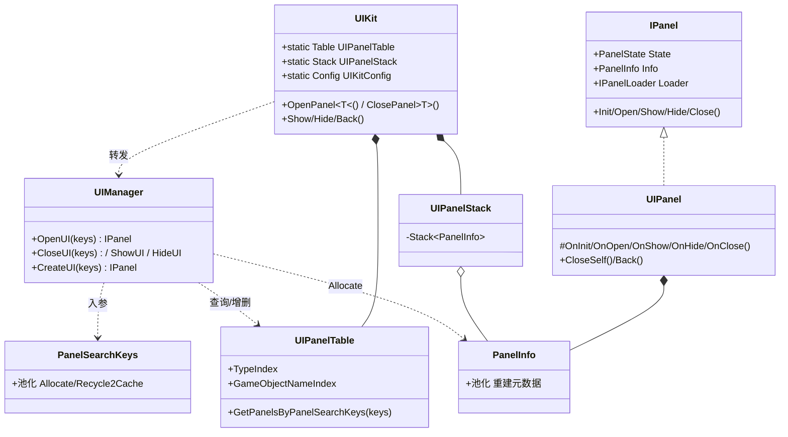
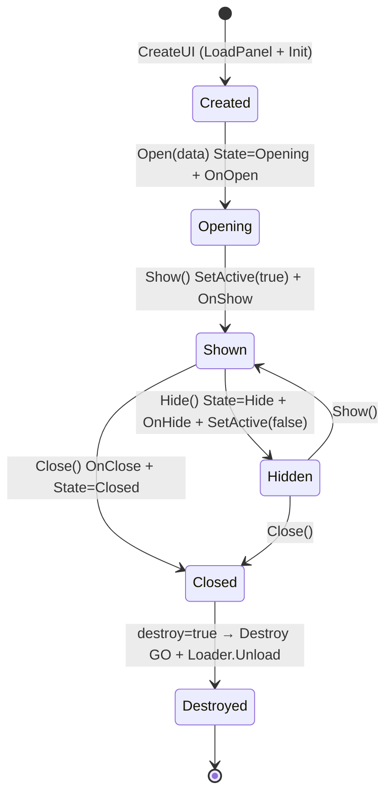
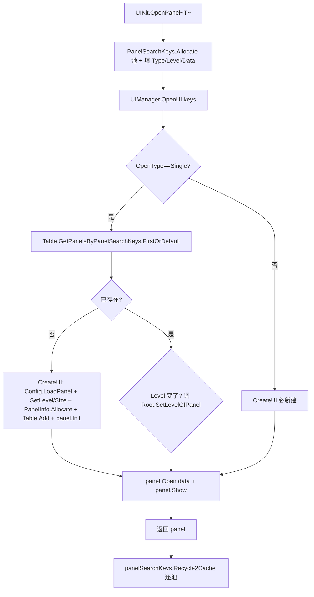

# 09 · UIKit 解析

> 源码（已读）：`UIKit.cs`（门面 422 行）、`IPanel.cs`、`UIPanel.cs`、`UIManager.cs`、`UIPanelTable.cs`、`UIPanelStack.cs`、`PanelSearchKeys.cs`、`PanelInfo.cs`。
> 未逐字读但涉及处会标注「未在本仓库验证」：`UIKitConfig.cs`（加载策略）、`UIRoot.cs`（层级/Canvas）、`IPanelLoader`（加载器接口）、`UIComponent/UIElement`（组件层）、`Editor/CodeGen`（代码生成）。

---

## 一、契约定义

### 核心类型清单

| 文件 | 类型 | 角色 | 可见性 |
|---|---|---|---|
| `UIKit.cs` | `UIKit`（static） | 门面：OpenPanel/ClosePanel/Show/Hide/Back + `Table`/`Stack`/`Config`/`Root` | public static |
| `UIManager.cs` | `UIManager : MonoBehaviour, ISingleton` | 实际调度：OpenUI/CloseUI/CreateUI/Show/Hide | public（Mono 单例） |
| `IPanel.cs` | `IPanel` / `PanelState` | 面板契约（Init/Open/Show/Hide/Close）+ 三态枚举 | public |
| `UIPanel.cs` | `UIPanel : MonoBehaviour, IPanel` | 面板基类，实现生命周期模板 + `OnInit/OnOpen/OnShow/OnHide/OnClose` 钩子 | public abstract |
| | `IUIData` / `UIPanelData` | 面板数据 DTO 契约 | public |
| `UIPanelTable.cs` | `UIPanelTable` + `UIKitTable<T>` + `UIKitTableIndex<K,V>` | 双索引（按 Type / 按 GameObject 名）的面板注册表 | public |
| `UIPanelStack.cs` | `UIPanelStack` | 界面导航栈（Push 关当前 / Pop 重开） | public |
| `PanelSearchKeys.cs` | `PanelSearchKeys : IPoolType, IPoolable` | **池化的查询参数对象**（一次操作的入参快照） | public |
| `PanelInfo.cs` | `PanelInfo : IPoolType, IPoolable` | **池化的面板元数据**（重建面板所需的全部信息） | public |

### 穿透语法的关键设计约束

1. **门面 → 单例管理器 → 数据结构 三层**：`UIKit`（静态门面，参数糖 + 重载爆炸）只负责把调用打包成 `PanelSearchKeys`，转发给 `UIManager.Instance`（Mono 单例，真正调度），`UIManager` 再操作 `UIKit.Table`（注册表）。门面层无状态，状态全在 Table/Stack。

2. **`PanelSearchKeys` 池化 + 用后即还（贯穿所有 API 的母题）**：每个 UIKit API 第一行 `PanelSearchKeys.Allocate()`（`SafeObjectPool`），最后一行 `panelSearchKeys.Recycle2Cache()`。这是一个"一次性查询参数对象"，承载本次操作的 Type/名字/Level/UIData/OpenType，用完立刻回池。**因为 UI 操作极高频，参数对象不能每次 new**（落地难点）。

3. **双索引注册表（`UIPanelTable`）**：面板同时被 `TypeIndex`（按 `panel.GetType()`）和 `GameObjectNameIndex`（按 `Transform.name`）索引，且每个 key 对应 `List<IPanel>`（同类型可多实例）。`GetPanelsByPanelSearchKeys` 按"有无 Type / 有无名字 / 有无 Panel 引用"组合查询。索引内部 `List` 来自 `ListPool`（复用）。

4. **`OpenType` 决定单例还是多开**：`PanelOpenType.Single` 先查 Table 有无已存在面板，有则复用（仅重新 Open+Show），无则 `CreateUI`；非 Single 则**每次都 `CreateUI`**新建（允许同类型多个实例）。

5. **面板生命周期是模板方法**：`UIPanel` 把 `Init/Open/Show/Hide/Close` 实现为模板（管状态机 `PanelState` + 调用钩子），子类只重写 `OnInit/OnOpen/OnShow/OnHide/OnClose`。`Close` 是显式接口实现 `void IPanel.Close()`——**子类不能直接调 Close，只能 `CloseSelf()`→`UIKit.ClosePanel(this)`**（强制走管理器流程）。

6. **导航栈 = PanelInfo 快照的栈**：`UIPanelStack.Push` 关闭当前面板并把它的 `PanelInfo`（重建所需元数据）压栈、从 Table 移除（不销毁记录，`RemoveUI`）；`Pop` 用 `PanelInfo` 重新 `OpenUI` 还原。栈里存的是**元数据快照而非面板实例**——所以 Pop 是"重新打开"而非"恢复对象"。

### Mermaid 类图

---

## 二、生命周期与内存

### 动词语义表

| 操作 | 做什么 | 内存影响 |
|---|---|---|
| `UIKit.OpenPanel<T>(...)` | `PanelSearchKeys.Allocate` 填参→`UIManager.OpenUI`→`Recycle2Cache` | 复用 keys（池）；Single 复用面板/非 Single 新建 |
| `UIManager.OpenUI(keys)` | Single：查 Table 有则复用+调级别，无则 `CreateUI`；都 `Open`+`Show` | 复用或新建面板 |
| `CreateUI(keys)` | `Config.LoadPanel`→设级别/尺寸/名→`PanelInfo.Allocate`→`Table.Add`→`panel.Init` | 加载 GameObject + 分配 PanelInfo（池） |
| `UIPanel.Open(data)` | `State=Opening` + `OnOpen` | 无 |
| `UIPanel.Show/Hide` | `SetActive(true/false)` + 状态 + `OnShow/OnHide` | 无（不销毁，仅激活切换） |
| `UIManager.CloseUI(keys)` | 取 `LastOrDefault`→`Close()`→`Table.Remove`→`Info.Recycle2Cache`+置 null | 回收 PanelInfo；面板默认 Destroy |
| `IPanel.Close(destroy=true)` | 回写 UIData→`mOnClosed`→Hide→`State=Closed`→`OnClose`→Destroy→`Loader.Unload`+回收 Loader | 销毁面板 GO + 卸载资源 + 回收 Loader |
| `Stack.Push(panel)` | 压 `panel.Info`→`panel.Close()`→`RemoveUI`（仅移出 Table 不销毁记录） | Info 入栈 |
| `Stack.Pop()` | 弹 `PanelInfo`→用其重建 `OpenUI` | 重新加载/打开面板 |
| `CloseAllUI` | 遍历 Table 全 Close + Info 回收 + `Table.Clear()` | 全部销毁 |

### 状态机：单个面板的 PanelState

### 关键流程：OpenPanel<T>(Single) 的完整链路

> 穿透点：`CloseUI` 用 `LastOrDefault`（取同名/同类型的**最后**一个），而 `GetUI`/`ShowUI`/`HideUI` 用 `FirstOrDefault`（第一个）。这是为多开面板设计的——关闭时关最新打开的那个，查询/显示时取最早的那个。

---

## 三、跨层桥接

### 核心层与上层如何对接

- **依赖 SingletonKit**：`UIManager : MonoBehaviour, ISingleton`（`[MonoSingletonPath("UIRoot/Manager")]`，挂在 UIRoot 下），`UIRoot.Instance` 也是单例。
- **依赖 PoolKit**：`PanelSearchKeys`/`PanelInfo` 都是 `SafeObjectPool` 池化对象；`UIKitTableIndex` 的 `List` 用 `ListPool`；Loader 也走 `PanelLoaderPool`（`Config.PanelLoaderPool`）。
- **依赖 ResKit（推断/经 Config 注入）**：`UIKit.Config.LoadPanel(keys)` 是加载面板预制体的注入点，实际实现可对接 ResKit/Resources/AssetBundle（`UIKitConfig` 未逐字读，标注「未验证」）。
- **可与 ActionKit 协作**：`OpenPanelAsync` 返回 `IEnumerator`，注释示例 `.ToAction().Start(this)` 接入 ActionKit。

### 注入点（Helper/Callback）

| 注入点 | 机制 |
|---|---|
| `UIKit.Config`（`UIKitConfig`） | `LoadPanel`/`LoadPanelAsync`/`SetDefaultSizeOfPanel`/`PanelLoaderPool` —— **加载策略全注入点** |
| `IPanelLoader` | 面板资源加载器接口（同步/异步加载 + Unload），可对接不同资源方案 |
| `IUIData` | 面板数据 DTO，`Open(uiData)` 时传入 |
| `UIPanel.OnInit/OnOpen/OnShow/OnHide/OnClose` | 子类生命周期钩子 |
| `panel.OnClosed(Action)` | 面板关闭回调注入 |

### 跨层 DTO / 快照

- `IUIData`：打开面板时携带的数据 DTO，在 `Open` 时注入、`Close` 时回写到 `Info.UIData`（**保证 Pop 重开时数据还原**）。
- `PanelInfo`：面板的"重建元数据快照"（名字/Level/UIData/Type/AB 名）。Stack 存它、CreateUI 时分配它——它是"面板可被关闭后再精确重建"的关键。
- `PanelSearchKeys`：一次操作的"查询参数快照"，池化、用后即还。

---

## 四、落地难点

1. **`PanelSearchKeys`/`PanelInfo` 双池化对象的生命周期边界**：SearchKeys 是"调用级"临时对象（Allocate→用→Recycle 在同一个 API 内闭环）；PanelInfo 是"面板级"对象（随面板 CreateUI 分配、随 CloseUI/Push 回收）。二者都用 `SafeObjectPool` + `IsRecycled` 防重复回收。仿写最易错：忘记在 API 末尾 Recycle SearchKeys（池泄漏），或 Close 后忘了回收 PanelInfo 又置 null。

2. **双索引一致性 + List 复用**：`UIPanelTable` 的 `TypeIndex` 和 `GameObjectNameIndex` 必须在 Add/Remove/Clear 时**同步维护**（`OnAdd` 两个都 Add，`OnRemove` 两个都 Remove），否则按 Type 查得到、按名字查不到。且索引内部 List 来自 `ListPool`，Dispose 时要 `Release2Pool` 还回去。任一索引漏更新都会让 `GetPanelsByPanelSearchKeys` 给出错误结果。

3. **栈存元数据而非实例 + UIData 回写**：`UIPanelStack` 压的是 `PanelInfo`（关闭并从 Table 移除真实面板），Pop 时用元数据**重新打开**。这要求 `Close` 时把 `mUIData` 回写到 `Info.UIData`，否则 Pop 重建的面板丢失数据状态。理解"导航返回 = 用快照重建"而非"恢复被隐藏的对象"是 UIKit 导航语义的核心（与"仅 Hide/Show"区分）。

## 五、坐标

- **优先级**：P2（业务承载层）。
- **依赖谁**：SingletonKit（UIManager/UIRoot 单例）、PoolKit（SearchKeys/Info/List/Loader 池化）、ResKit（经 Config.LoadPanel 注入，推断）、ActionKit（异步打开可选协作）。
- **被谁依赖**：游戏业务的 UI 层。
