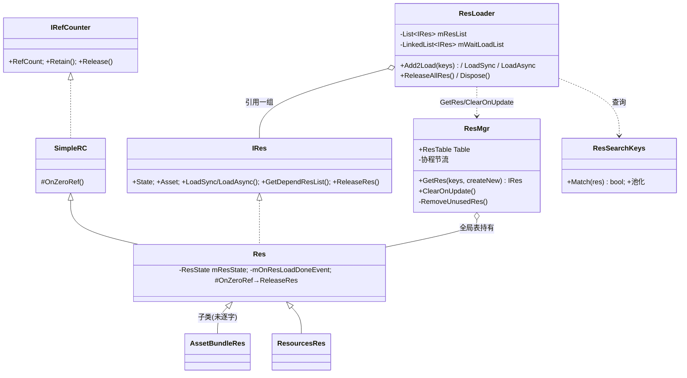
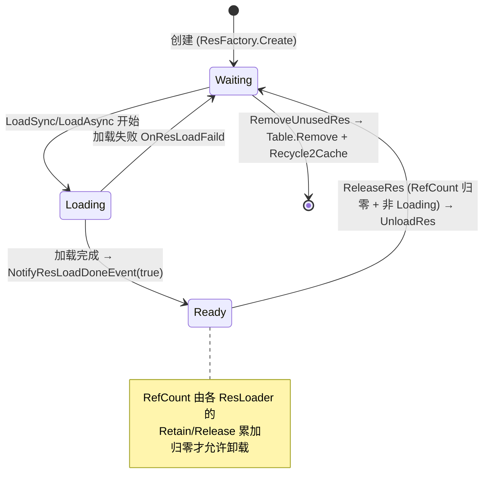
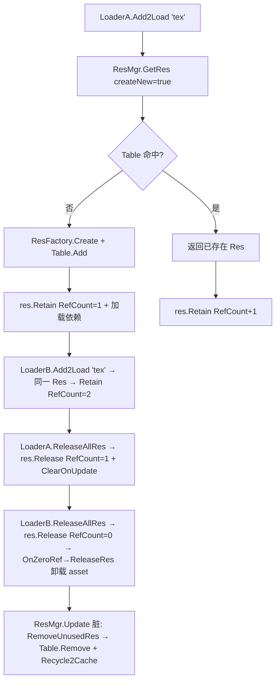

# 10 · ResKit 解析

> 源码（已读主干）：`Utility/RefCounter.cs`、`Framework/Res/IRes.cs`、`Framework/Res/Res.cs`、`Framework/ResMgr.cs`、`Framework/ResSearchKeys.cs`、`Framework/ResLoader/ResLoader.cs`。
> 未逐字读（聚焦主干、说明取舍）：`ResTable.cs`、`ResFactory.cs`/`IResCreator.cs`、各 `Implements/*`（AssetBundleRes/AssetRes/ResourcesRes/NetImageRes 等具体资源类型）、`HotFixDowload/*`（热更下载，独立子系统）、`Utility/BinarySerializer`、`ConfigFile`。涉及处标注「未在本仓库逐字验证」。
> ResKit 是全框架最大的业务模块（数十文件），本文聚焦其**主干设计：双层引用计数 + 资源全局表 + 延迟卸载**。

---

## 一、契约定义

### 核心类型清单（主干）

| 文件 | 类型 | 角色 | 可见性 |
|---|---|---|---|
| `RefCounter.cs` | `IRefCounter` / `SimpleRC` / `SafeARC` / `UnsafeARC` | 引用计数契约与三种实现 | public |
| `IRes.cs` | `IRes : IRefCounter, IEnumeratorTask` | 单个资源契约（状态/加载/依赖/事件/引用计数） | public |
| `IRes.cs` | `ResState` / `ResLoadType` | 资源状态枚举 + 加载类型常量 | public |
| `Res.cs` | `Res : SimpleRC, IRes` | 资源基类（状态机 + 加载完成事件 + 依赖持有/释放 + 零引用自动释放） | public |
| `ResMgr.cs` | `ResMgr : MonoBehaviour, ISingleton` | **全局资源管理器**：持 `ResTable` + 协程并发控制 + 脏标记延迟卸载 | public（Mono 单例） |
| `ResLoader.cs` | `ResLoader : IResLoader, IPoolType, IPoolable` | **用户侧加载器**：管理"本加载器持有的一组资源引用"，Dispose/回收时整批释放 | public（池化） |
| `ResSearchKeys.cs` | `ResSearchKeys : IPoolable, IPoolType` | 池化的资源查询键（assetName/bundle/type）+ `Match(res)` | public |
| `ResFactory`/`IResCreator` | 资源创建策略（按 ResLoadType 造对应 Res 子类） | 工厂注入点 | public（未逐字读） |
| `ResTable` | 资源全局表（多索引，类比 UIPanelTable） | public（未逐字读） |

### 穿透语法的关键设计约束

1. **双层引用计数（最核心）**：
   - **资源级**：`Res : SimpleRC`，每个资源有 `RefCount`。`Retain()` 加、`Release()` 减，减到 0 触发 `OnZeroRef()`→`ReleaseRes()`（卸载 asset）。
   - **加载器级**：`ResLoader` 持 `List<IRes> mResList`，`Add2Load` 时对资源 `res.Retain()`，`ReleaseRes`/Dispose 时对持有的每个资源 `res.Release()`。
   - **语义**：多个 ResLoader 可共享同一个 Res（全局表里唯一），每个 Loader 持有一份引用。**只有当所有 Loader 都释放、RefCount 归零，资源才真正卸载**。这是共享资源安全卸载的根（落地难点 No.1）。

2. **资源全局唯一 + 表去重**：`ResMgr.GetRes(keys, createNew)` 先查 `Table.GetResBySearchKeys`，命中即返回（同一资源全局一份）；未命中且 `createNew` 才 `ResFactory.Create` 并 `Table.Add`。**资源对象本身是全局共享的**，引用计数管理其生命周期。

3. **延迟卸载（脏标记 + Update 扫描，迭代安全母题）**：`ResLoader.Release` 不立即从全局表删资源，只调 `res.Release()` + `ResMgr.Instance.ClearOnUpdate()`（置 `mIsResMapDirty=true`）。`ResMgr.Update` 检测脏标记后 `RemoveUnusedRes`：遍历 `Table.ToArray()`，对 `RefCount<=0 且 State!=Loading` 的资源 `ReleaseRes`+`Table.Remove`+`Recycle2Cache`。**卸载推迟到帧末统一处理**，避免在加载/释放过程中改表。

4. **依赖资源的连带引用**：`Add2Load` 时 `res.GetDependResList()` 拿依赖（如 AB 依赖其他 AB），对每个依赖也 `Add2Load`（连带 Retain）。`Res.HoldDependRes/UnHoldDependRes` 维护依赖的引用。**加载一个资源会连带持有其依赖链**，确保依赖不被提前卸载。

5. **加载完成事件 + 一次性触发**：`Res.RegisteOnResLoadDoneEvent`——若已 Ready 立即回调，否则挂 `mOnResLoadDoneEvent`；`State` 变 Ready 时 `NotifyResLoadDoneEvent(true)` 触发后**置 null**（一次性，触发即清）。

6. **协程并发节流**：`ResMgr` 用 `mIEnumeratorTaskStack`（LinkedList）+ `mMaxCoroutineCount=8` 限制同时进行的异步加载协程数，超出排队。`IEnumeratorTask` 是异步加载任务契约。

7. **`ResLoader` 池化 + Recycle 即释放**：`ResLoader : IPoolable`，`Allocate` 从 `SafeObjectPool` 取，`OnRecycled`/`Recycle2Cache` 调 `ReleaseAllRes()`——**归还加载器 = 释放它持有的所有资源引用**。

### Mermaid 类图

---

## 二、生命周期与内存

### 动词语义表

| 操作 | 做什么 | 引用计数/内存影响 |
|---|---|---|
| `ResLoader.Allocate()` | 从 `SafeObjectPool<ResLoader>` 取 | 复用加载器 |
| `Add2Load(keys)` | `ResMgr.GetRes(keys, true)` 取/建资源→连带加载依赖→`AddRes2Array`（`res.Retain()` + 入 mResList） | 资源 RefCount +1；首次创建则全局表 +1 |
| `LoadResSync` | `Add2Load` + `LoadSync` 同步加载 + 取回 | 同上 + 触发实际 IO |
| `Res.State = Ready` | 触发 `mOnResLoadDoneEvent(true)` 后置 null | 一次性事件 |
| `ResLoader.ReleaseRes(name)` | 从 mResList 移除 + `res.Release()`（RefCount −1）+ `ClearOnUpdate()` | RefCount −1；标脏待卸载 |
| `Res.Release()`（RefCount→0） | `OnZeroRef()`→`ReleaseRes()`→`UnloadRes(asset)` | 卸载 Unity 资源 |
| `ResMgr.RemoveUnusedRes()`（Update 脏时） | 遍历表，RefCount<=0 且非 Loading 者 ReleaseRes + Table.Remove + Recycle2Cache | 真正从表删除 + 资源对象回池 |
| `ResLoader.Recycle2Cache()` / `OnRecycled` | `ReleaseAllRes()` + 销毁 `mObject2Unload` 中实例化对象 + 还池 | 释放该加载器全部引用 |
| `ResLoader.Dispose()` | `ReleaseAllRes()` | 同上（不还池） |

### 状态机：单个 Res 的状态 + 引用计数

### 关键流程：加载→共享→释放→延迟卸载

> 穿透点：资源真正卸载需要"两个条件 + 两个阶段"。条件：`RefCount<=0` 且 `State!=Loading`（正在加载中的资源即使引用为 0 也不能卸，否则崩）。阶段：`Release()` 时只标脏（`ClearOnUpdate`），`ResMgr.Update` 帧末才真正 `Table.Remove + Recycle2Cache`。这套"引用计数 + 延迟卸载"是 ResKit 内存安全的核心。

---

## 三、跨层桥接

### 核心层与上层如何对接

- **依赖 SingletonKit**：`ResMgr : MonoBehaviour, ISingleton`（`[MonoSingletonPath("QFramework/ResKit/ResManager")]`）。
- **依赖 PoolKit（重度）**：`ResMgr.Init` 里把 `AssetBundleRes`/`AssetRes`/`ResourcesRes`/`NetImageRes`/`ResSearchKeys`/`ResLoader` 全部 `SafeObjectPool.Init(40,20)` 预热。所有资源对象、查询键、加载器都池化。
- **被 UIKit 依赖**：UIKit 的面板加载（`UIKitConfig.LoadPanel`）可对接 ResKit 的 `ResLoader`（推断，UIKitConfig 未逐字读）。
- **HotFix 子系统**：`HotFixDowload/` 是独立的热更下载（MD5/AES/RSA 校验 + AB 下载），与主干资源加载相对独立，本文不展开。

### 注入点（Helper/Callback）

| 注入点 | 机制 |
|---|---|
| `IResCreator`/`ResFactory` | 按 `ResLoadType` 创建对应 Res 子类的策略（资源类型扩展点） |
| `Add2Load(keys, listener)` | 单资源加载完成回调注入 |
| `RegisteOnResLoadDoneEvent` | 资源 Ready 事件注入（已 Ready 则立即回调） |
| `AddObjectForDestroyWhenRecycle2Cache` | 把实例化对象登记到加载器，加载器回收时连带 Destroy |
| `IRefCounter` 三实现 | `SimpleRC`(计数)/`SafeARC`(按 owner 去重的 HashSet)/`UnsafeARC` —— 引用计数策略可换 |

### 跨层 DTO / 快照

- `ResSearchKeys`：池化查询键，承载 assetName（强制 `ToLower`）/ownerBundle/assetType，`Match(res)` 做匹配判定。一次查询的参数快照。
- `Progress`：ResLoader 聚合所有待加载资源进度的可读快照（按资源数均分 + 各自 progress 累加）。
- 加载完成回调 `Action<bool, IRes>`：result + 资源引用，作为加载结果 DTO。

---

## 四、落地难点

1. **双层引用计数的协同（最核心、最易错）**：加载器级（ResLoader.mResList 的 Retain/Release）与资源级（Res.RefCount 的 OnZeroRef）必须严格配对。每个 `Add2Load` 必有对应的 `Release`（在 ReleaseRes/ReleaseAllRes/Recycle）。漏 Release → 资源永不卸载（泄漏）；多 Release → RefCount 变负或提前卸载导致其他 Loader 持有的资源失效（悬挂）。`SafeARC` 用 `HashSet<owner>` 去重正是为了在 debug 期捕获"同一 owner 重复 Retain/Release"的错误。

2. **延迟卸载 + "Loading 中不可卸载"的边界**：`RemoveUnusedRes` 的判定是 `RefCount<=0 && State!=ResState.Loading`。正在异步加载的资源即使引用归零也不能卸（协程还在用它）。且卸载走脏标记 + Update 扫描而非即时——理解"为什么不能在 Release 当场删表"（可能正在遍历/加载）是仿写关键。

3. **依赖链的连带引用 + AB 卸载顺序**：加载资源连带 `Add2Load` 其依赖（Retain 依赖）；`ReleaseAllRes` 时 `mResList.Reverse()` 确保**先释放 AB 后释放 Asset**（注释明示，为优化 Asset 卸载）。依赖管理 + 卸载顺序是 AssetBundle 场景的硬骨头，漏掉会导致依赖被提前卸载或卸载报错。

## 五、坐标

- **优先级**：P2（业务承载层，框架最大模块）。
- **依赖谁**：SingletonKit（ResMgr 单例）、PoolKit（重度，所有资源/键/加载器池化）、ZipKit（解压，推断）、JsonKit/BinarySerializer（配置表）。
- **被谁依赖**：UIKit（面板加载，推断）、AudioKit（音频资源，推断）、业务资源加载。
