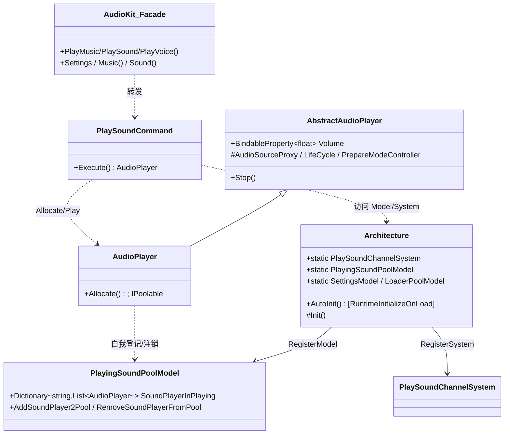
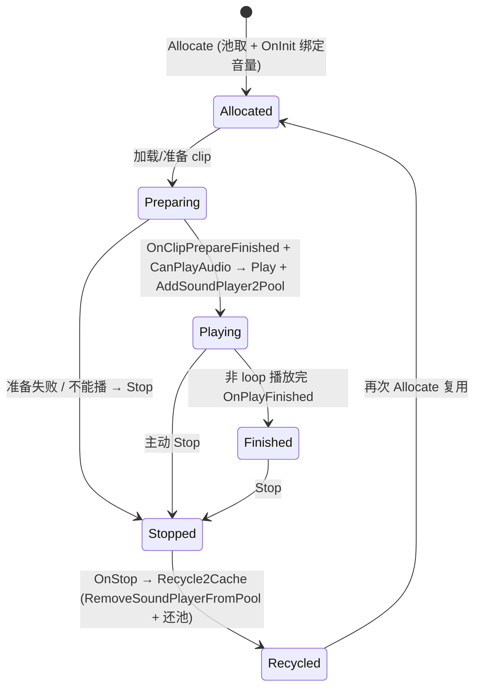
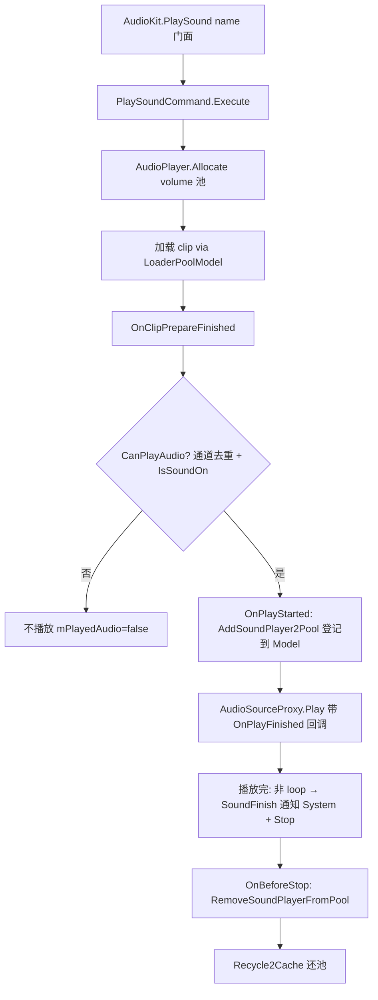

# 11 · AudioKit 解析

> 源码（已读主干）：`AudioKitArchitecture.cs`、`AudioKit.cs`（门面）、`Player/AbstractAudioPlayer.cs`、`Player/AudioPlayer.cs`、`Architecture/Model/PlayingSoundPoolModel.cs`。
> 未逐字读（聚焦主干、说明取舍）：各 `Command/{Music,Sound,Voice}/*`（命令实现）、`PlaySoundChannelSystem/*`（去重通道）、`AudioKitSettingsModel`、`AudioLoaderPoolModel`、`MusicPlayer.cs`、`AudioSourceController.cs`、`Player/Features/*`、`FluentAPI/*`、`Action/PlaySound.cs`。涉及处标注「未在本仓库逐字验证」。
> **AudioKit 是全框架唯一完整构建在 CoreArchitecture（QFramework.cs 的 Architecture/Model/System/Command）之上的业务模块** —— 它是"母题如何组装成一个真实功能"的最佳范本。

---

## 一、契约定义

### 核心类型清单（主干）

| 文件 | 类型 | 角色 | 可见性 |
|---|---|---|---|
| `AudioKitArchitecture.cs` | `Architecture : Architecture<Architecture>` | AudioKit 私有架构容器（注册 3 Model + 2 System），`[RuntimeInitializeOnLoadMethod]` 自动初始化 | internal |
| `AudioKit.cs` | `AudioKit`（static） | 门面：PlayMusic/PlaySound/PlayVoice/Stop/Settings/Fluent，**全部转发给 Command** | public static |
| `AbstractAudioPlayer.cs` | `AbstractAudioPlayer` | 播放器抽象基类：组合 `AudioSourceProxy`+`LifeCycle`+`PrepareModeController` | public abstract |
| `AudioPlayer.cs` | `AudioPlayer : AbstractAudioPlayer, IPoolable, IPoolType` | 音效播放器（**池化**），自管进出"正在播放池" | public |
| `MusicPlayer.cs` | `MusicPlayer` | 音乐/人声播放器（单实例，未逐字读） | public |
| `PlayingSoundPoolModel.cs` | `PlayingSoundPoolModel : AbstractModel` | Model：记录"正在播放的音效"（按名分组） | internal |
| `AudioKitSettingsModel` | Model：音量/开关（`BindableProperty`） | internal（未逐字读） |
| `AudioLoaderPoolModel` | Model：音频资源加载器池 | internal（未逐字读） |
| `PlaySoundChannelSystem` | System：音效去重通道（同帧/同名忽略） | internal（未逐字读） |
| `Command/*` | `PlaySoundCommand`/`PlayMusicCommand`/... | 每个操作一个 Command | internal（未逐字读） |

### 穿透语法的关键设计约束

1. **门面 → Command → Model/System：标准 MVC 数据流**。`AudioKit.PlayMusic(...)` 只是 `PlayMusicCommand.Execute(...)`。Command 在 `OnExecute` 里读写 Model（如 `PlayingSoundPoolModel`）、调 System（如 `PlaySoundChannelSystem`）。**门面无逻辑，逻辑在 Command，状态在 Model**——这是 CoreArchitecture 母题的教科书式应用（落地难点）。

2. **私有架构 + 自动初始化**：`internal class Architecture : Architecture<Architecture>`（注意：类名就叫 `Architecture`，继承 `Architecture<Architecture>` CRTP）。`[RuntimeInitializeOnLoadMethod(BeforeSceneLoad)]` 的 `AutoInit` 在场景加载前 `InitArchitecture()`——**AudioKit 自己的架构实例独立于游戏主架构**，模块自包含。`Init()` 里 `RegisterSystem`/`RegisterModel` 三 Model 两 System。

3. **Model/System 作为静态属性持有**：`Architecture.PlayingSoundPoolModel`/`SettingsModel`/`LoaderPoolModel`/`PlaySoundChannelSystem` 都是 `static { get; } = new()`。Command/Player 直接 `Architecture.PlayingSoundPoolModel.XXX` 访问——**模块内部不走 `this.GetModel<>()` 扩展，而是直接静态访问**（因为 AudioKit 的架构是单一确定的，省去能力接口的间接）。

4. **AudioPlayer 池化 + 自我管理在播池**：`AudioPlayer : IPoolable`，`Allocate` 从 `SafeObjectPool` 取。播放开始 `OnPlayStarted` 把自己 `AddSoundPlayer2Pool`（加入 Model 的"正在播放"记录），停止 `OnBeforeStop` 把自己 `RemoveSoundPlayerFromPool`，`OnStop` 调 `Recycle2Cache` 还池。**播放器自己维护"我在不在播放中"的全局记录**。

5. **播放器是组合而非继承功能**：`AbstractAudioPlayer` 组合三个内部对象——`AudioSourceProxy`（封装 Unity AudioSource）、`AudioPlayerLifeCycle`（OnStart/OnFinish 回调一次性管理）、`ClipPrepareModeController`（clip 加载准备策略）。功能拆成可组合的 feature，而非塞进一个大类（母题：组合派生）。

6. **音量用 BindableProperty 联动**：`OnInit` 里 `Volume.RegisterWithInitValue(AudioSourceProxy.SetVolume)`——音量变更自动同步到 AudioSource。Settings 的音量是 `BindableProperty`，UI 滑条双向绑定（门面注释示例）。**BindableKit 母题在此落地**。

### Mermaid 类图

---

## 二、生命周期与内存

### 动词语义表

| 操作 | 做什么 | 内存影响 |
|---|---|---|
| `Architecture.AutoInit()`（BeforeSceneLoad） | `InitArchitecture()`→注册并初始化 Model/System | 一次性建架构 + Model/System |
| `AudioKit.PlaySound(name)` | `PlaySoundCommand.Execute`→`AudioPlayer.Allocate`→加载 clip→播放 | 复用 AudioPlayer（池） |
| `AudioPlayer.Allocate(volume)` | 从池取 + `OnInit`（绑定音量到 AudioSource） | 复用 |
| `OnPlayStarted` | 若实际播放，把自己 `AddSoundPlayer2Pool(name, this)` | Model 字典记录 +1 |
| `CanPlayAudio()` | `PlaySoundChannelSystem.CanPlaySound(this) && Settings.IsSoundOn` | 去重判定 |
| `OnPlayFinished` | 非 loop 时通知 System `SoundFinish` + `LifeCycle.CallOnFinishOnce` + Stop | — |
| `Stop()` | `OnBeforeStop`（从 Model 移除）→`ClearDataAndStop`→`OnStop`（Recycle2Cache） | 还池 |
| `Recycle2Cache` | `SafeObjectPool.Recycle`（失败则 `AudioSourceProxy.OnParentRecycled`） | 还池 |
| `Volume.Value = x` | 触发 `BindableProperty` → `AudioSourceProxy.SetVolume` | 联动 |

### 状态机：一个 AudioPlayer（音效）的生命周期

### 关键流程：PlaySound 的 MVC 链路

> 穿透点：`AudioPlayer` 自己负责"进出 Model 记录"——`OnPlayStarted` 登记、`OnBeforeStop` 注销。Command 只负责"启动"，播放器的全生命周期自治。这让 Model（`PlayingSoundPoolModel`）始终精确反映"当前正在播放哪些音效"，供 `StopAllSound`/去重通道查询。

---

## 三、跨层桥接

### 核心层与上层如何对接

- **依赖 CoreArchitecture（定义性依赖）**：`Architecture : Architecture<Architecture>`，用 Model/System/Command/`SendCommand`。这是 AudioKit 区别于其他 Kit 的根本——它不是"用了几个工具类"，而是"完整套用了 QFramework 的架构范式"。
- **依赖 PoolKit**：`AudioPlayer`/查询对象 `SafeObjectPool` 池化；`PlayingSoundPoolModel.ForEachAllSound` 用 `ListPool` 做安全遍历快照。
- **依赖 BindableKit**：`Settings` 的音量/开关是 `BindableProperty`，与 AudioSource 和 UI 双向联动。
- **依赖 SingletonKit**：`AudioManager`（持 MusicPlayer/VoicePlayer，未逐字读）疑似 Mono 单例。
- **依赖 ResKit（推断）**：`AudioLoaderPoolModel` 加载音频 clip，可对接 ResKit。
- **可与 ActionKit 协作**：`Action/PlaySound.cs` 把播放包装成 ActionKit 动作（未逐字读）。

### 注入点（Helper/Callback）

| 注入点 | 机制 |
|---|---|
| `onBeganCallback`/`onEndCallback`（PlayMusic 等） | 播放开始/结束回调 |
| `PlaySoundModes` + `PlaySoundChannelSystem` | 去重策略（EveryOne / 同帧忽略同名 / 全局帧忽略） |
| `Settings.IsSoundOn/MusicVolume`（BindableProperty） | 开关与音量注入点 |
| `AudioKit.Config`（`AudioLoaderPoolModel`） | 音频加载器策略 |
| `ClipPrepareModeController` | clip 准备策略（同步/异步加载） |
| Fluent API（`Music()`/`Sound()`） | 链式配置播放参数 |

### 跨层 DTO / 快照

- `PlayingSoundPoolModel.SoundPlayerInPlaying`：当前正在播放音效的快照（按名分组的 `List<AudioPlayer>`），`ForEachAllSound` 用 ListPool 快照遍历（避免遍历中增删）。
- `BindableProperty<float> Volume`：音量可观测快照，变更推送给 AudioSource。
- Command 的参数（name/loop/volume/pitch/playSoundMode）是一次播放请求的 DTO。

---

## 四、落地难点

1. **完整套用 Architecture 范式的"模块自包含"**：AudioKit 用独立的 `Architecture<Architecture>` + `[RuntimeInitializeOnLoadMethod]` 自动初始化，使整个音频子系统成为一个自治的 MVC 单元，不依赖游戏主架构。仿写难点在于理解"一个库内部也可以有自己的微型架构"，以及为什么模块内部直接 `Architecture.XxxModel` 静态访问而非走能力接口（确定单一架构下间接层是冗余）。

2. **播放器自管在播记录的一致性**：`AudioPlayer` 在 `OnPlayStarted`/`OnBeforeStop` 自己增删 `PlayingSoundPoolModel` 的记录，且只在 `mPlayedAudio==true`（确实播放了）时才登记/注销。若登记与注销不配对（如被去重通道拦截没播却注销，或播了忘注销），`SoundPlayerInPlaying` 会与实际状态不符，导致 `StopAllSound` 漏停或去重误判。

3. **去重通道 + 遍历安全**：`PlaySoundChannelSystem` 实现"同帧/全局帧忽略同名音效"防止一帧内重复播放爆音；`ForEachAllSound` 用 `ListPool` 先拷贝快照再遍历（因为遍历中可能 Stop→RemoveSoundPlayerFromPool 改字典）。这是"快照遍历"母题在业务层的又一次出现，漏掉会在批量停止时崩。

## 五、坐标

- **优先级**：P2（业务承载层，CoreArchitecture 的范例应用）。
- **依赖谁**：CoreArchitecture（定义性，Model/System/Command）、PoolKit、BindableKit、SingletonKit、ResKit（推断）、ActionKit（可选）。
- **被谁依赖**：游戏音频业务。
