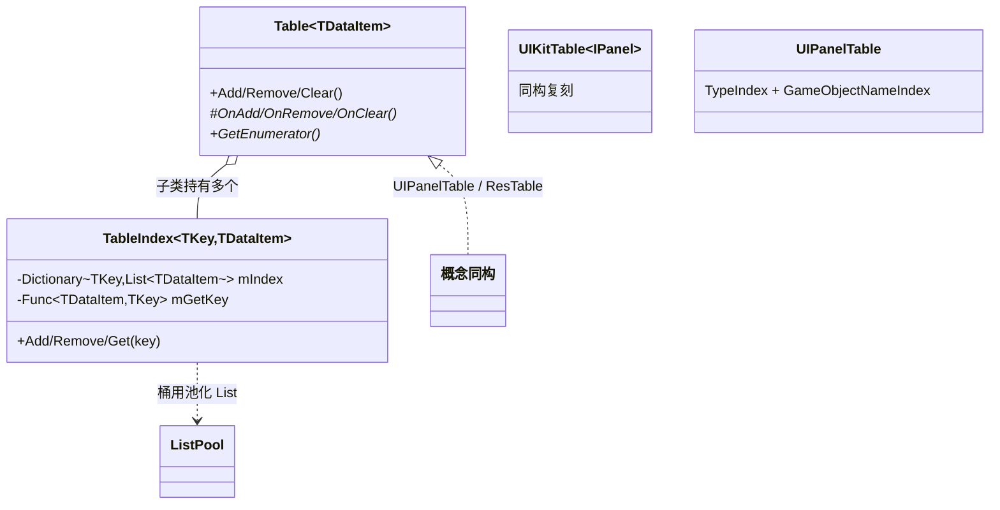
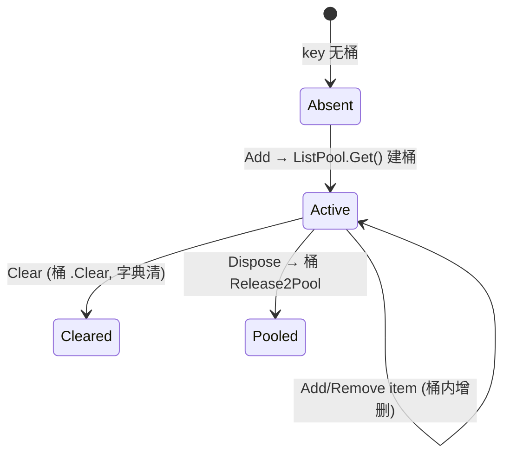

# 12 · 工具层（ToolLayer）解析

> 工具层是一组**轻量、独立、低耦合**的小模块，本文作为合并条目，覆盖代表性样本：
> - 已读源码：`GridKit/EasyGrid.cs`、`TableKit/Script/TableKit.cs`、`LogKit/LogKit.cs`（前 130 行）、`FluentAPI/*`（结构已扫描，01 阶段读过若干扩展）。
> - 未逐字读（机制清晰、概览说明）：`GridKit/DynaGrid.cs`、`JsonKit/JsonKit.cs`（2237 行，第三方风格序列化器）、`LocaleKit`、`GraphKit`、`CodeGenKit`、`PackageKit`、`ConsoleKit`、`ZipKit`、`ScriptKit`。涉及处标注「未在本仓库逐字验证」。

---

## 一、契约定义

### 代表模块清单

| 模块 | 核心类型 | 角色 | 关键设计 |
|---|---|---|---|
| **GridKit** | `EasyGrid<T>` | 二维网格数据结构 | `T[,]` + 越界保护 + `Fill/Resize/ForEach/Clear` 高阶函数 |
| | `DynaGrid<T>`（未逐字读） | 可动态扩展的网格（推断支持负坐标） | — |
| **TableKit** | `Table<TDataItem>` + `TableIndex<TKey,TDataItem>` | 多索引可联合查询的"表" | 抽象基类 + 多个索引字典，每索引 `Dictionary<key,List<item>>` |
| **LogKit** | `LogKit`（static） + `LogLevel` | 分级日志 | 等级阈值过滤 + 转发 `UnityEngine.Debug` + FluentAPI 扩展 |
| **FluentAPI** | 大量 `*Extension` 静态类 | 链式扩展方法 | 对 Unity/C# 类型加扩展方法，返回 self 以链式 |

### 穿透语法的关键设计约束

1. **TableKit 是 UIPanelTable / ResTable 的"抽象母版"**（最重要的跨模块发现）。对比可见：`UIKit.UIPanelTable : UIKitTable<IPanel>` 和 `TableKit.Table<T>` **结构完全同构**——都是"抽象 `Table` 基类（Add/Remove/Clear/GetEnumerator/Dispose 模板）+ 多个 `TableIndex<K,V>`（`Dictionary<K,List<V>>` + keyGetter）"。UIKit 的 `UIKitTableIndex` 与 TableKit 的 `TableIndex` 几乎逐行相同。**框架内"多索引注册表"这一数据结构被抽象进 TableKit，又在 UIKit/ResKit 各自重新实现了一份**（落地启示）。

2. **TableIndex 复用 ListPool**：`TableIndex.Add` 新建索引桶时 `ListPool<TDataItem>.Get()`，`Dispose` 时 `value.Release2Pool()` + `mIndex.Release2Pool()`。**连索引内部的 List 都池化**——PoolKit 母题渗透到工具层。

3. **EasyGrid 的越界保护 + 高阶函数式 API**：`this[x,y]` getter/setter 内置边界检查（越界 `Debug.LogWarning` 返回 default，不抛异常——容错母题"静默/告警失败"）；`Fill/ForEach/Resize` 接受 `Func/Action` 委托，把"对每个格子做什么"注入（Helper 注入母题）。

4. **LogKit 的等级阈值过滤**：`I/W/E` 各自先判 `mLogLevel < LogLevel.Xxx` 提前 return，再转发 `Debug.Log*`。**统一日志入口 + 等级开关**，可全局关停低等级日志（发布期降噪）。

5. **FluentAPI 纯扩展方法，返回 self 链式**：如 `transform.SetLocalPositionX(1).SetLocalScale(2)`。**不改变被扩展类型，只增加流畅语法**——这是"能力接口 + 扩展方法"母题的纯语法糖形态（无架构语义）。

### Mermaid 类图（TableKit 母版 vs 业务表）

---

## 二、生命周期与内存

### 动词语义表

| 模块·操作 | 做什么 | 内存影响 |
|---|---|---|
| `EasyGrid(w,h)` | `new T[w,h]` | 分配二维数组 |
| `EasyGrid.Resize(w,h,onAdd)` | 建新数组拷旧值 + onAdd 填新格 + 旧数组 Fill default 后替换 | 分配新数组（旧数组待 GC） |
| `EasyGrid.Clear(cleanup)` | 逐格 cleanup 回调 + 置 default + `mGrid=null` | 释放数组引用 |
| `Table.Add(item)` | `OnAdd`→各 `TableIndex.Add` | 索引桶首建时从 ListPool 取 |
| `TableIndex.Add` | keyGetter 取 key→有桶则 Add，无则 `ListPool.Get()` 新桶 | 复用 List |
| `TableIndex.Get(key)` | `TryGetValue` 命中返回桶，否则 `Enumerable.Empty` | 无分配 |
| `Table.Dispose` | 各 `TableIndex.Dispose`→桶 `Release2Pool` + index 字典 `Release2Pool` | 池化归还 |
| `LogKit.I/W/E` | 等级过滤后转发 Debug | 无（仅日志） |

### 状态机：TableIndex 的一个 key 桶

### 关键流程：Table 联合查询

> 穿透点：TableKit 的"联合查询"= 用某个索引快速取一个子集（O(1) 命中桶），再用 LINQ 在子集上做二次条件过滤。**索引负责"按 key 快速分桶"，LINQ 负责"桶内任意条件"**——空间换时间，对高频查询维度建索引，低频条件走 LINQ。

---

## 三、跨层桥接

### 核心层与上层如何对接

- **TableKit ← PoolKit**：索引桶 `ListPool`。
- **LogKit ← FluentAPI**：`"msg".LogInfo()` 扩展。
- **被框架内复用**：TableKit 的模式被 UIKit（`UIPanelTable`）、ResKit（`ResTable`）各自内联实现。GridKit 被棋盘类玩法（扫雷/五子棋 Demo）使用。FluentAPI 被全框架（含 ActionKit 的 `ShortCut`）广泛调用。

### 注入点（Helper/Callback）

| 注入点 | 机制 |
|---|---|
| `TableIndex(keyGetter)` | 注入"如何从 item 取 key" |
| `Table.OnAdd/OnRemove/OnClear` | 子类注入"维护哪些索引" |
| `EasyGrid.Fill/ForEach/Resize(Func/Action)` | 注入逐格操作 |
| `LogKit` 的 `LogLevel` | 全局等级开关 |

### 跨层 DTO / 快照

工具层基本不传 DTO，提供的是数据结构与语法糖。`EasyGrid.ForEach((x,y,content)=>...)` 把每格坐标+内容作为遍历快照回调出去。

---

## 四、落地难点

1. **TableKit 抽象 vs 业务内联的取舍**：框架已有 TableKit 的 `Table<T>`/`TableIndex`，但 UIKit/ResKit 没有复用它，而是各自抄了一份（`UIKitTable`/`ResTable`）。这揭示一个真实工程权衡——**通用抽象 vs 模块自包含**：复用 TableKit 会让 UIKit 依赖 TableKit；内联一份保持模块独立（可单独裁剪）。仿写时要意识到"代码重复"有时是"解耦"的代价，需按模块边界策略决定。

2. **EasyGrid.Resize 的数据迁移正确性**：Resize 要把旧网格内容拷到新网格的对应位置、对新增区域调 `onAdd`、且分"x 方向扩展"和"y 方向扩展"两段循环处理。这种二维数组扩容的边界（哪些格子是拷贝、哪些是新增）极易写错（如漏拷某个角落区域）。

3. **FluentAPI 的链式返回值一致性**：每个扩展方法必须 `return self`（或相关对象）才能链式。混入返回 void 的方法会打断链。且扩展方法是静态分发（编译期按声明类型选择），对多态对象可能不走预期重载——这是扩展方法的固有陷阱。

## 五、坐标

- **优先级**：P3（工具层，按需使用）。
- **依赖谁**：PoolKit（TableKit）、FluentAPI（LogKit）、UnityEngine。
- **被谁依赖**：GridKit→棋盘玩法；TableKit→数据查询（且其模式被 UIKit/ResKit 复刻）；LogKit/FluentAPI→全框架。
