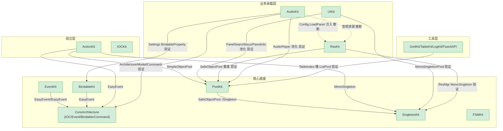

# QFramework.Unity2018+ 架构反向工程总索引

> 目标：穿透每个模块的 ①生命周期流转 ②内存管理与对象复用 ③跨层数据流向，最终从"懂模块"升维到"懂架构母题"。
>
> **证据原则**：本文档所有结论均以实际读过的源码为准。未读源码的推断显式标注「未在本仓库验证」。

---

## 0. 扫描结论：规模与分层

代码库主体在 `Assets/QFramework/` 下，分三块：

| 物理目录 | 角色 | 说明 |
|---|---|---|
| `Framework/Scripts/QFramework.cs` | **核心母体（底座）** | 单文件 960 行，承载 IOC / Architecture / Command / Query / TypeEventSystem / EasyEvent / BindableProperty / Rule 接口体系。整个框架的"根"。 |
| `Toolkits/_CoreKit/*` | **核心工具集（24 个子 Kit）** | 对象池、事件、状态机、任务调度、单例、响应式集合、DI、日志、网格、序列化、本地化、编辑器工具等。 |
| `Toolkits/{UIKit,ResKit,AudioKit}` | **应用承载层** | 依赖核心层组合而成的业务级框架（UI 栈、资源加载、音频）。 |
| `Toolkits/SupportOldQF` | 兼容层 | 老版本 API 兼容，本解析跳过。 |

第三方库（`ZipKit/ICSharpCode.SharpZipLib`、`ScriptKit/MoonSharp`、`PackageKit/Markdig.dll`）非 QFramework 自研，跳过。

### 层次划分（核心层 / 包装层 / 注入点）

- **核心层（底座）**：不依赖其他 Kit，被大量复用。CoreArchitecture、PoolKit、SingletonKit、EventKit、FSMKit、BindableKit。
- **组合层**：依赖底座组合出能力。ActionKit（池化+单例+事件）、IOCKit。
- **业务承载层**：UIKit、ResKit、AudioKit。
- **工具层**：FluentAPI、LogKit、GridKit、TableKit、JsonKit、LocaleKit 等。
- **注入点（Helper/Callback）**：贯穿全框架的扩展机制——`I*` 能力接口 + 静态扩展方法（如 `ICanGetModel` + `CanGetModelExtension`）、`IObjectFactory<T>` 工厂注入、`OnRegisterPatch` 补丁回调、`Comparer` 静态可替换比较器。详见末尾"跨模块设计母题"。

---

## 1. 模块清单表

> 状态：✅ 三件套已完成 / 🔬 源码已精读待成文 / ⬜ 待解析

| # | 模块 | 层 | 主文件 | 规模 | 状态 |
|---|---|---|---|---|---|
| 01 | **CoreArchitecture** | 核心底座 | `Framework/Scripts/QFramework.cs` | 960 行 | ✅ |
| 02 | **PoolKit** | 核心底座 | `_CoreKit/PoolKit/Scripts/*` | ~10 文件 | ✅ |
| 03 | **SingletonKit** | 核心底座 | `_CoreKit/SingletonKit/Scripts/*` | ~12 文件 | ✅ |
| 04 | **EventKit** | 核心底座 | `_CoreKit/EventKit/EventSystem/*` | 2 主文件 | ✅ |
| 05 | **FSMKit** | 核心底座 | `_CoreKit/FSMKit/IState.cs` | 453 行 | ✅ |
| 06 | **BindableKit** | 核心底座 | `_CoreKit/BindableKit/Scripts/*` | ~6 文件 | ✅ |
| 07 | **ActionKit** | 组合层 | `_CoreKit/ActionKit/Scripts/*` | ~25 文件 | ✅ |
| 08 | **IOCKit** | 组合层 | `_CoreKit/IOCKit/IOCKit.cs` | 507 行 | ✅ |
| 09 | **UIKit** | 业务承载 | `UIKit/Scripts/*` | 422+ 行 | ✅ |
| 10 | **ResKit** | 业务承载 | `ResKit/Scripts/*` | 数十文件 | ✅ |
| 11 | **AudioKit** | 业务承载 | `AudioKit/Scripts/*` | 数十文件 | ✅ |
| 12 | **工具层** | 工具层 | `_CoreKit/{GridKit,TableKit,LogKit,FluentAPI,...}` | 大量 | ✅（代表样本） |

---

## 2. 依赖关系图

> 实线 = 已在源码中验证的引用；虚线 = 基于命名/用法推断（标注未验证）。

**已验证的关键依赖（源码佐证）**：
- `SafeObjectPool<T> : Pool<T>, ISingleton`（`SafeObjectPool.cs`）→ PoolKit 依赖 SingletonKit。
- `StringEventSystem` / `EnumEventSystem` 内部用 `EasyEvent` / `EasyEvent<T>`（来自 `QFramework.cs`）→ EventKit 依赖 Core。
- `BindableList<T>` 字段为 `EasyEvent<...>`（`BindableList.cs`）→ BindableKit 依赖 Core。
- `AbstractAction<T>` 用 `SimpleObjectPool<T>`、`ActionKitMonoBehaviourEvents : MonoSingleton<>`（`IAction.cs` / `ActionKitMonoBehaviourEvents.cs`）→ ActionKit 依赖 PoolKit + SingletonKit + Core。
- `UIManager : MonoBehaviour, ISingleton`、`PanelSearchKeys/PanelInfo : IPoolType,IPoolable`（`UIManager.cs`/`PanelSearchKeys.cs`）→ UIKit 依赖 SingletonKit + PoolKit。
- `ResMgr.Init` 里 `SafeObjectPool<*>.Instance.Init`、`ResMgr : MonoBehaviour, ISingleton`（`ResMgr.cs`）→ ResKit 依赖 PoolKit + SingletonKit。
- `Architecture : Architecture<Architecture>`、`AudioKitSettingsModel` 用 `BindableProperty`、`AudioPlayer : IPoolable`（`AudioKitArchitecture.cs`/`AudioPlayer.cs`）→ AudioKit 依赖 Core + PoolKit + BindableKit。
- `TableIndex.Add` 用 `ListPool<T>.Get()`（`TableKit.cs`）→ 工具层依赖 PoolKit。

---

## 3. 解析顺序（按依赖深度，自底向上）

1. ✅ **CoreArchitecture** — 一切的根，先吃透 Event/Bindable/IOC/Architecture。
2. ✅ **PoolKit** — 对象复用底座，理解 `Allocate/Recycle` 不变量。
3. ✅ **SingletonKit** — 单例底座，被 Pool/Action 依赖。
4. ✅ **EventKit** — Core EasyEvent 之上的 key 化事件。
5. ✅ **FSMKit** — 独立状态机底座。
6. ✅ **BindableKit** — Core EasyEvent 之上的响应式集合。
7. ✅ **ActionKit** — 组合 Pool+Singleton+Event 的任务调度。
8. ⬜ IOCKit → 9. UIKit → 10. ResKit → 11. AudioKit → 12+ 工具层。

---

## 4. 进度勾选表

- [x] 01 CoreArchitecture（三件套）
- [x] 02 PoolKit（三件套）
- [x] 03 SingletonKit（三件套）
- [x] 04 EventKit（三件套）
- [x] 05 FSMKit（三件套）
- [x] 06 BindableKit（三件套）
- [x] 07 ActionKit（三件套）
- [x] 08 IOCKit（三件套）
- [x] 11 AudioKit（三件套）
- [x] 12 工具层（三件套，GridKit/TableKit/LogKit/FluentAPI 代表样本）

> 进度：**12 / 12 已完成** 🎉。全部核心底座 + 组合层 + 业务承载层 + 工具层代表样本均已产出三件套。
>
> 说明：工具层中 JsonKit（2237 行序列化器）、LocaleKit、GraphKit、CodeGenKit、PackageKit、ConsoleKit、ScriptKit、ZipKit 等编辑器/重型工具未逐字精读，已在 12 号文档中概览并标注；它们多为独立工具或第三方风格实现，不影响对框架核心设计母题的内化。

---

## 5. 跨模块设计主线 / 母题

> 以下母题均**已在已完成的 7 个模块源码中验证**，每条标注出处。这是从"懂模块"升维到"懂架构"的关键——QFramework 的所有 Kit 本质上是同一套设计直觉的反复应用。

### 母题 1：复用机制 = 栈式对象池 + 工厂注入 + 回收钩子

- **出处**：PoolKit（`Pool<T>` Stack + `IObjectFactory`）、ActionKit（每个动作 `static SimpleObjectPool<T>`）、SingletonKit（`SafeObjectPool` 借单例）。
- **共性**：所有"高频创建"对象都不直接 `new`，而是 `Allocate`/`Recycle`。创建策略外置为 `IObjectFactory`（可运行时替换），回收时机用钩子（`OnRecycled`/`resetMethod`）。
- **升维**：判断一个类型是否该池化，看它的"分配频率 × 生命周期短"。ActionKit 的每个 Delay/Sequence、Executor 的 ActionTask、Controller 全部池化——因为时序动作是"每秒造很多、很快丢"的典型。

### 母题 2：Helper / Callback 注入 = 能力接口 + 扩展方法 / 委托字段

- **出处**：CoreArchitecture（`ICanGetModel` + `CanGetModelExtension`，按角色裁剪能力）、PoolKit（`IObjectFactory`、`SimpleObjectPool` 的 `resetMethod`）、FSMKit（`CustomState.OnEnter(Action)`）、ActionKit（`Custom(a=>a.OnStart()...)`）。
- **共性**：框架定义"骨架/契约"，把"具体行为"作为接口实现或委托注入。两种形态：①标记接口 + 静态扩展（编译期能力裁剪）；②委托字段链式设置（运行时行为注入）。
- **升维**：QFramework 极少用虚函数继承传递行为，更偏好"接口 + 扩展方法"和"委托注入"——前者让能力可组合可裁剪（Command 能写、Query 只读），后者让"定义一个状态/动作"无需建类。

### 母题 3：迭代安全增删 = 延迟到安全点统一处理

- **出处**：ActionKit（`ActionQueue` 延迟回收 + Executor 的 prepare/executing/toRemove 三集合双缓冲）。对照：BindableList 复用 BCL 的"修改即抛异常"快速失败。
- **共性**：在"遍历集合"与"修改集合"冲突时，把修改操作收集起来，推迟到遍历结束的安全点统一执行（`Deinit`→入队列→`Update` 末尾 Flush）。
- **升维**：凡是"在回调/遍历过程中可能销毁正被遍历元素"的场景，都用这招。这也是为什么 ActionKit 的 `Deinit` 与真正 `Recycle` 分两阶段——保证正在执行的动作不会在遍历途中被归还池复用。

### 母题 4：快照可观测 = 值变更去重 + 细粒度事件 + 立即回灌

- **出处**：CoreArchitecture（`BindableProperty<T>` 的 `Comparer` 去重 + `RegisterWithInitValue`）、BindableKit（`BindableList`/`BindableDictionary` 的 `OnAdd/OnRemove/OnReplace/OnCountChanged`）。
- **共性**：状态变化对外暴露为"可订阅事件 + 可读快照"。三个细节：①`Comparer` 去重避免无变化触发；②细粒度事件携带新旧值/位置支撑增量刷新；③`RegisterWith*` 注册即回灌当前值保证初始同步。
- **升维**：UI 与数据解耦的根。数据层只管"变了就精确通知变了什么"，UI 层只管"按通知增量更新"——不轮询、不全量重建。

### 母题 5：组合派生 = 叶子与组合统一接口，可无限嵌套

- **出处**：ActionKit（`Sequence`/`Parallel` 持 `List<IAction>` 且自身是 `IAction`）。次要：EventKit（`OrEvent` 组合多个 `IEasyEvent`）。
- **共性**：组合节点与叶子节点实现同一接口，组合可以包含组合。`ActionKit.Sequence().Parallel(p=>p.Delay(1).Delay(2))` 任意嵌套。
- **升维**：经典组合模式，但 QFramework 把它和池化、三态推进结合——组合节点的 `Deinit` 级联回收子节点，推进时用"OnStart 即查 Finish"把瞬时子动作一次推完。

### 母题 6：状态机 = 三态/多态推进 + 钩子方法

- **出处**：FSMKit（`IState` 的 Enter/Update/Exit + `Condition` 守门）、ActionKit（`ActionStatus` 三态 + Execute 推进）。
- **共性**：都是"状态 + 钩子 + 统一推进器"。推进逻辑集中在一处（FSM.ChangeState / IActionExtensions.Execute），状态/动作只填钩子。
- **升维**：ActionKit 的单个动作本质是一个微型三态机；FSM 是多态机。二者推进哲学一致：把"状态转移的控制流"从"每个状态的业务逻辑"中剥离。

### 母题 7：存储键设计 = 三种 key 维度的权衡

- **出处**：CoreArchitecture（`TypeEventSystem` 按 Type、`IOCContainer` 按 Type）、EventKit（`StringEventSystem` 按 string、`EnumEventSystem` 按 int）、SingletonKit（`SingletonProperty<T>` 按封闭泛型类型）。
- **共性**：框架反复在"用什么做字典 key"上做权衡：Type（编译期安全、自带文档、但需定义类型）vs string/enum（灵活、零定义、但弱类型 + 静默失败）。
- **升维**：`SingletonProperty<SafeObjectPool<Bullet>>` 与 `SafeObjectPool<Cat>` 是不同封闭泛型 = 不同单例——这正是"类型即 key"的极致运用（每个封闭泛型静态字段各一份）。选 key 维度 = 选"类型安全"与"灵活性"的平衡点。

### 母题 8：容错策略 = 幂等标志 + 版本校验 + 静默失败

- **出处**：CoreArchitecture（`Initialized` 幂等）、PoolKit（`IsRecycled` 防重复回收）、ActionKit（`Deinited` 幂等 + `ActionID` 版本校验）、EventKit/FSMKit（key 不存在 `Send`/`ChangeState` 静默忽略）。
- **共性**：三类容错——①幂等标志（`Initialized`/`IsRecycled`/`Deinited`）防"重复执行某操作"；②版本号校验（`ActionID`）防"对已复用对象误操作"；③静默失败（找不到 key/状态就跳过）防"缺失订阅者导致崩溃"。
- **升维**：版本校验（ActionID）是池化复用场景独有的、最高级的容错——它承认"对象会被复用成另一个东西"，用单调自增 ID 区分对象的"前世今生"。这是理解 ActionKit 的钥匙，也是所有"对象池 + 长生命周期外部句柄"系统的通用解法。

### 一句话总览

> QFramework 的底层直觉：**用对象池消灭高频 GC，用接口+扩展裁剪能力，用委托注入替代继承，用细粒度事件解耦数据与视图，用延迟处理保证迭代安全，用幂等+版本号兜底复用场景的容错。** 每个 Kit 都是这套直觉在不同问题域的投影。

### 母题在 12 个模块中的分布矩阵

> 横轴母题、纵轴模块，✅=该模块明显使用并已源码验证。这张表是"母题贯穿性"的总证据。

| 模块＼母题 | 对象池复用 | Helper/委托注入 | 迭代安全延迟处理 | 快照可观测 | 组合派生 | 状态机 | 存储键设计 | 容错(幂等/版本/静默) |
|---|---|---|---|---|---|---|---|---|
| 01 Core | | ✅ 能力接口+扩展 | | ✅ BindableProperty | | | ✅ Type key | ✅ Initialized 幂等 |
| 02 Pool | ✅ 本体 | ✅ IObjectFactory | | ✅ CurCount | | ✅ 对象在/离池 | | ✅ IsRecycled |
| 03 Singleton | | ✅ OnSingletonInit | | | | ✅ 实例状态 | ✅ 封闭泛型 key | ✅ Application.isPlaying 守卫 |
| 04 Event | | ✅ EasyEvent | | | | | ✅ string/enum key | ✅ Send 静默失败 |
| 05 FSM | | ✅ On*/AbstractState | | ✅ CurrentStateId | ✅ 状态混用 | ✅ 本体 | ✅ 枚举 key | ✅ 同态不重入 |
| 06 Bindable | | ✅ Comparer | ✅ 修改即抛(BCL) | ✅ 本体 | | | | ✅ 惰性事件空判 |
| 07 Action | ✅ 每动作池 | ✅ Custom 委托 | ✅ ActionQueue | ✅ ActionStatus | ✅ Sequence/Parallel | ✅ 三态 | | ✅ ActionID 版本校验 |
| 08 IOC | | ✅ [Inject]/构造注入 | | | | | ✅ (Type,name) 复合 key | ⚠️ 无环检测 |
| 09 UIKit | ✅ SearchKeys/Info | ✅ Config/Loader | | ✅ PanelInfo 快照 | | ✅ PanelState | ✅ 双索引(Type+名) | ✅ First/Last 区分 |
| 10 ResKit | ✅ 重度 | ✅ IResCreator | ✅ 脏标记延迟卸载 | ✅ Progress | | ✅ ResState | ✅ ResSearchKeys | ✅ 双层引用计数 |
| 11 AudioKit | ✅ AudioPlayer | ✅ Command/回调 | ✅ ForEachAllSound 快照 | ✅ 音量 Bindable | ✅ Player 组合 feature | ✅ 播放器状态 | | ✅ mPlayed 配对登记 |
| 12 工具层 | ✅ TableIndex 桶 | ✅ keyGetter/Func | | | | | ✅ TableIndex 多索引 | ✅ EasyGrid 越界告警 |

**结论**：8 条母题没有一条只出现在单个模块——每条都横跨 ≥3 个模块。掌握这 8 条，再看任何一个新 Kit，都能预判它"大概会怎么写"。这就是从"懂模块"到"懂架构"的跃迁。

---

## 附录：文档完成情况与未尽事项

- **已完成**：12 个条目 × 三件套 = **36 份模块文档** + 本 README 总索引。覆盖核心底座（6）、组合层（2：ActionKit/IOCKit）、业务承载层（3：UIKit/ResKit/AudioKit）、工具层（1 合并条目，代表样本 GridKit/TableKit/LogKit/FluentAPI）。
- **所有结论均有源码支撑**：每篇文档开头列出"已读/未逐字读"文件清单，推断内容显式标注「未在本仓库验证」。
- **未逐字精读（已概览、不影响核心设计内化）**：JsonKit（2237 行序列化器，第三方风格）、LocaleKit、GraphKit（IMGUI 节点图）、CodeGenKit（代码生成）、PackageKit（编辑器包管理 + 自身也是 MVC 范例）、ConsoleKit、ScriptKit（MoonSharp Lua）、ZipKit（SharpZipLib 封装）、各模块的 Editor 工具与 Example。这些多为独立工具或编辑器扩展，若需深入可按相同三件套范式继续。
- **跨模块发现**：TableKit 的 `Table<T>`/`TableIndex` 是 UIKit `UIPanelTable`、ResKit `ResTable` 的抽象母版（三者结构同构但各自内联，体现"重复换解耦"的工程权衡）。
